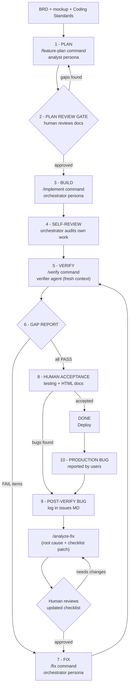

# AI-First Development Playbook — Team Edition

**Spec → Build → Verify.** A lean, repeatable process for spec-driven AI development in a
team — engineered to close the verification gap, enforce cross-cutting rules, and make
every document readable by both the model and the humans.

> This is the **team edition** of a two-edition family.
> The **solo edition** is [TechieFlow](https://github.com/techierathore/TechieFlow) —
> one philosophy at two scales. See [Relationship to TechieFlow](#relationship-to-techieflow).

---

## The problem

AI coding agents implement a checklist, then *declare* themselves done. In our production
use we found three structural gaps behind the bugs that leaked:

1. **There is no closed verification loop — you are the loop.** Nothing independent
   re-derives expected behaviour from the spec and checks the artifact. The agent that
   wrote the code cannot reliably check it.
2. **Cross-cutting rules live inside long per-feature docs the model deprioritises.**
   Logging, error handling, coding standards, and UI fidelity slide under context
   pressure.
3. **Commands don't enforce context gathering.** When context was missing, the AI guessed
   wrong. Commands must *ask* for what they need.

The reframe this playbook is built on: *you do not have an AI quality problem — you have
a missing process step, unenforced standards, and insufficient context enforcement.* Move
the verification loop into the system, promote ambient rules to always-on context, and
make commands demand their inputs.

## Who this is for

- Engineering teams (roughly 5–50 devs) adopting AI-first development on an existing,
  real-world codebase — not a demo repo.
- A designated **process owner** who installs and maintains the framework, plus
  developers who drive it day to day.
- Originally built for a .NET + React multi-cloud product on the OpenCode harness with
  BMAD v4 personas; the process itself is harness-portable.

## The lifecycle at a glance

Ten steps, four gates (gates in orange). One file per step under [`phases/`](phases/).



| # | Step | Driven by | In one line |
|---|------|-----------|-------------|
| 1 | [Plan](phases/01-plan.md) | `/feature-plan` (analyst) | Produce the full verifiable document set; the command asks for every missing input |
| 2 | [Plan Review **gate**](phases/02-plan-review-gate.md) | human | Cheap to fix a plan; expensive to fix built code |
| 3 | [Build](phases/03-build.md) | `/implement` (orchestrator) | Parallel sub-agents build from the checklist with standing rules always in context |
| 4 | [Self-review](phases/04-self-review.md) | orchestrator | Re-read checklist vs own diff; build + smoke test before declaring done |
| 5 | [Verify **gate**](phases/05-verify.md) | `/verify` (Verifier agent) | Fresh-context independent audit that *executes* the code — the keystone |
| 6 | [Gap report **gate**](phases/06-gap-report-gate.md) | Verifier output | PASS/FAIL per item with evidence, annotated inline in the checklist |
| 7 | [Fix](phases/07-fix.md) | `/fix` (orchestrator) | Fix only the FAIL items; loop back to Verify until clean |
| 8 | [Human acceptance](phases/08-human-acceptance.md) | you / QA / BA | Manual testing for what automated checks can't catch |
| 9 | [Post-verification bugs **gate**](phases/09-post-verification-bugs.md) | `/analyze-fix` (analyst) | Root-cause *why the Verifier missed it*; every escaped bug tightens the checklist |
| 10 | [Production bugs](phases/10-production-bugs.md) | `/analyze-fix` → `/fix` → `/verify` | Same loop; the checklist accumulates every real-world failure as a verifiable item |

## The Verifier — the keystone

A **fresh-context, independent agent** (it did not write the code, so it has no reason to
believe the work is done) that must prove every claim by **running the real code path and
observing the real side effect**:

- **Playwright MCP** for web UI: checks every mockup element via the accessibility tree,
  takes screenshots. Code audit is the explicit *last resort*, never the default.
- **dotnet integration tests and runner consoles** it writes itself under
  `verification/` — builds the app's host, triggers the real sync/job, opens a real
  `SqlConnection` using the app's own config, asserts the view actually populated,
  greps the real logs for the required INFO lines.
- **Environment probing + real config only**: `command -v` for every tool it needs;
  connection strings from `appsettings.Development.json` — never invented, never logged.
- **Three forbidden excuses**: "no SQL access", "can't run the web app", "can't run the
  Windows app". Each has a prescribed workaround; only the human may authorize skipping.
- Verdicts: `PASS`, `FAIL`, `PASS (code-audit)`, `FAIL (code-audit)`, `BLOCKED` — written
  inline in the checklist with evidence. *"A 200 response with zero rows written is a
  FAIL, not a pass."*

Full spec: [`templates/verifier-agent.md`](templates/verifier-agent.md) and
[`phases/05-verify.md`](phases/05-verify.md).

## The command library

**Four commands carry the daily loop**; nine more support it. Specs (one file per
command) live in [`templates/commands/`](templates/commands/).

| Core loop | What it does |
|---|---|
| `/feature-plan` | Analyst produces the full verifiable document set from BRD + mockup + standards |
| `/implement` | Orchestrator builds from the checklist with parallel sub-agents + smoke-test self-check |
| `/verify` | Independent Verifier audits by execution; annotates PASS/FAIL inline |
| `/fix` | Orchestrator fixes FAIL-annotated items only; re-verify until ALL PASS |

Supporting: `/analyze-fix`, `/add-doc`, `/refresh-doc`, `/upgrade-docs`,
`/create-issue-list`, `/amend-checklist`, `/archive-checklist`, `/generate-html`,
`/update-context`.

## Quickstart

The full setup runbook is in the phase docs; the short version:

1. **Commit the framework files** to your shared repo root: the Verifier agent
   definition, the command files, the HTML doc-shell template, an `AGENTS.md` with the
   standing rules ([template](templates/agents-md-template.md)), and a `Context-Prompt.md`
   cold-start primer.
2. **Per machine (optional):** start Playwright MCP on the host
   (`npx @playwright/mcp@latest --port 8931 --allowed-hosts "*"`) and point your harness
   at it. Skipping it just means UI verification falls back to code-audit mode.
3. **Smoke test:** run `/verify` against a feature checklist with known bugs and confirm
   the Verifier annotates them FAIL inline.
4. **Run your first feature** through the loop: `/feature-plan` → review → `/implement`
   → `/verify` → `/fix` until ALL PASS.
5. **Read [ADOPTION-LESSONS.md](ADOPTION-LESSONS.md) before rolling out to a team.**
   Steps 1–4 are the easy part; we learned that the hard way.

## Relationship to TechieFlow

One philosophy — *spec-driven, independently verified, execution-proven AI development* —
at two scales:

| | **TechieFlow** (solo edition) | **This repo** (team edition) |
|---|---|---|
| Optimized for | One developer + AI, portfolio of apps | A team on one large product, with QA/BA/business stakeholders |
| Lifecycle | Compressed 5 phases (Day-1 → Split → Build → Verify → Handoff) | 10 steps, 4 gates, per-feature loop |
| Checklist | One checklist per app (`REQ-*` rows) | One living implementation checklist per feature |
| Verifier | Playwright/Appium + `dotnet test`, hook-enforced verify ledger | Fresh-context native agent; execution-proven verdicts inline in the checklist |
| Human docs | DevGuide, UsageGuide, ProductGuide | Developer-Flow-Guide, Business-Verification-Reference, verification guides |
| Extras | — | Jira/Confluence integration, post-verification bug feedback loop, token-efficiency discipline for a whole team |

Both share: markdown as source of truth, Mermaid-only diagrams, HTML for human docs only,
"verify by executing, not by reading", and single-source-of-truth checklists.

## Adoption lessons (the honest part)

This process ran in production at a real company — and team adoption **stalled at 2 of 15
developers**. The tooling worked; the enablement didn't. The full post-mortem, and what
we'd do differently, is in [ADOPTION-LESSONS.md](ADOPTION-LESSONS.md). If you only read
one file beyond this README, read that one.

## Repo map

```
README.md                  ← you are here
DECISIONS.md               ← decision log (why sibling repo, license)
ADOPTION-LESSONS.md        ← the 2/15 stall, diagnosed honestly
phases/                    ← one file per lifecycle step (01–10)
diagrams/                  ← Mermaid sources for every diagram
templates/
  commands/                ← one spec per command (13)
  verifier-agent.md        ← the Verifier agent spec
  checklist-item-template.md
  deployment-steps-template.md
  agents-md-template.md    ← standing rules for AGENTS.md
  issues-file-template.md
LICENSE                    ← Apache-2.0
```

## Provenance & attribution

Converted from an internal playbook (v2.5) proven on a production multi-cloud product;
company- and product-specific names have been genericized. The original implementation
ran on [OpenCode](https://opencode.ai) with persona agents from
[BMAD-METHOD](https://github.com/bmad-code-org/BMAD-METHOD) (MIT); BMAD content is
referenced, not redistributed. No capability described here is invented — everything was
run in production, including the failures.

## License

[Apache-2.0](LICENSE) — same license as TechieFlow, by design.
