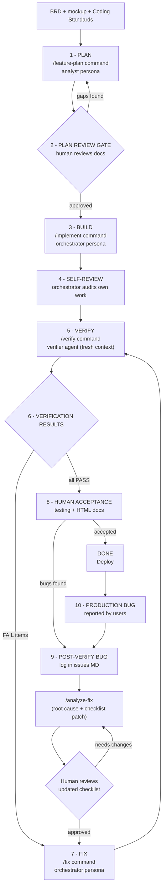

# AI-First Development Playbook — Team Edition

[](https://www.npmjs.com/package/@techierathore/ai-first-playbook)

Published on npm as
[`@techierathore/ai-first-playbook`](https://www.npmjs.com/package/@techierathore/ai-first-playbook).

**Spec → Build → Verify.** A lean, repeatable process for spec-driven AI development in a
team — engineered to close the verification gap, enforce cross-cutting rules, and make
every document readable by both the model and the humans.

> This is the **team edition** of a two-edition family.
> The **solo edition** is [TechieFlow](https://github.com/techierathore/TechieFlow) —
> one philosophy at two scales. See [Relationship to TechieFlow](#relationship-to-techieflow).

---

## The problem

AI coding agents implement a checklist, then *declare* themselves done. Three structural
gaps sit behind the bugs that leak:

1. **There is no closed verification loop — you are the loop.** Nothing independent
   re-derives expected behaviour from the spec and checks the artifact. The agent that
   wrote the code cannot reliably check it.
2. **Cross-cutting rules live inside long per-feature docs the model deprioritises.**
   Logging, error handling, coding standards, and UI fidelity slide under context
   pressure.
3. **Commands don’t enforce context gathering.** When context is missing, the AI guesses
   wrong. Commands must *ask* for what they need.

The reframe this playbook is built on: *you do not have an AI quality problem — you have
a missing process step, unenforced standards, and insufficient context enforcement.* Move
the verification loop into the system, promote ambient rules to always-on context, and
make commands demand their inputs.

## Who this is for

- Engineering teams (roughly 5–50 devs) adopting AI-first development on an existing,
  real-world codebase — not a demo repo.
- A designated **process owner** who installs and maintains the framework, plus
  developers who drive it day to day.
- Built on the OpenCode harness with BMAD v4 personas, against a .NET + React stack; the
  process itself is harness- and stack-portable — a generated
  [Claude Code pack](harness/claude-code/) ships alongside the OpenCode original.
- **Per-phase model routing:** each command declares the model tier it needs
  (frontier / standard / economy) in [`playbook/model-tiers.yml`](playbook/model-tiers.yml),
  so planning runs on a frontier model while mechanical phases run on cheap ones — the
  dominant cost lever. Ships off; `node scripts/playbook-routing.mjs on|off|status` operates it. Operator guide: [`docs/Model-Routing-Guide.md`](docs/Model-Routing-Guide.md);
  design rationale: [`docs/Adapter-Design.md`](docs/Adapter-Design.md). Per-phase cost
  capture plus committed miss/escape/rework history: [`docs/Telemetry-Guide.md`](docs/Telemetry-Guide.md).
- **YOLO mode — unattended end-to-end runs:** add `YOLO` to any command, set a `/goal`, or
  run `node scripts/playbook-yolo.mjs --goal "…"` on a VM. Every permission prompt is
  auto-approved mechanically (except git history, which stays denied), every in-command
  approval gate is pre-approved, the build phase must finish the **whole** checklist, and
  provider usage limits (5-hour / weekly) are waited out — reset time + 15 min — with the
  same session resumed until the goal is complete. Guide:
  [`docs/YOLO-Mode-Guide.md`](docs/YOLO-Mode-Guide.md).

## The lifecycle at a glance

Ten steps, four gates (gates in orange). One file per step under [`phases/`](phases/).



| # | Step | Driven by | In one line |
|---|------|-----------|-------------|
| 1 | [Plan](phases/01-plan.md) | `/feature-plan` (analyst) | Produce the full verifiable document set; the command asks for every missing input |
| 2 | [Plan Review **gate**](phases/02-plan-review-gate.md) | human | Cheap to fix a plan; expensive to fix built code |
| 3 | [Build](phases/03-build.md) | `/implement` (orchestrator) | Parallel sub-agents build from the checklist with standing rules always in context |
| 4 | [Self-review](phases/04-self-review.md) | orchestrator | Re-read checklist vs own diff; build + smoke test before declaring done |
| 5 | [Verify **gate**](phases/05-verify.md) | `/verify` (Verifier agent) | Fresh-context independent audit that *executes* the code — the keystone |
| 6 | [Verification results **gate**](phases/06-verification-results-gate.md) | Verifier output | PASS/FAIL/DATA-GAP/BLOCKED per item with evidence, annotated inline in the checklist |
| 7 | [Fix](phases/07-fix.md) | `/fix` (orchestrator) | Fix only the FAIL items; loop back to Verify until clean |
| 8 | [Human acceptance](phases/08-human-acceptance.md) | you / QA / BA | Manual testing for what automated checks can't catch |
| 9 | [Post-verification bugs **gate**](phases/09-post-verification-bugs.md) | `/analyze-fix` (analyst) | Root-cause *why the Verifier missed it*; every escaped bug tightens the checklist |
| 10 | [Production bugs](phases/10-production-bugs.md) | `/analyze-fix` → `/fix` → `/verify` | Same loop; the checklist accumulates every real-world failure as a verifiable item |

## The Verifier — the keystone

A **fresh-context, independent agent** (it did not write the code, so it has no reason to
believe the work is done) that must prove every claim by **running the real code path and
observing the real side effect**:

- **Playwright MCP** for web UI: checks every mockup element via the accessibility tree,
  takes screenshots. Code audit is the explicit *last resort*, never the default.
- **dotnet integration tests and runner consoles** it writes itself under
  `verification/` — builds the app's host, triggers the real sync/job, opens a real
  `SqlConnection` using the app's own config, asserts the view actually populated,
  greps the real logs for the required INFO lines.
- **Environment probing + real config only**: `command -v` for every tool it needs;
  connection strings from `appsettings.Development.json` — never invented, never logged.
- **Three forbidden excuses**: "no SQL access", "can't run the web app", "can't run the
  Windows app". Each has a prescribed workaround; only the human may authorize skipping.
- Verdicts: `PASS`, `FAIL`, `PASS (code-audit)`, `FAIL (code-audit)`, `DATA-GAP`, `BLOCKED` — written
  inline in the checklist with evidence. *"A 200 response with zero rows written is a
  FAIL, not a pass."*

Full spec: [`templates/verifier-agent.md`](templates/verifier-agent.md) and
[`phases/05-verify.md`](phases/05-verify.md). The **runnable agent** — all 1,050 lines of
probes, anti-excuse rules, and verdict discipline — is
[`harness/opencode/agent/verifier.md`](harness/opencode/agent/verifier.md).

## The command library

**Four commands carry the daily loop**; eleven more support it. Specs (one file per
command) live in [`templates/commands/`](templates/commands/); the **runnable command
files** are in [`harness/opencode/command/`](harness/opencode/command/).

| Core loop | What it does |
|---|---|
| `/feature-plan` | Analyst produces the full verifiable document set from BRD + mockup + standards |
| `/implement` | Orchestrator builds from the checklist with parallel sub-agents + smoke-test self-check |
| `/verify` | Independent Verifier audits by execution; annotates PASS/FAIL inline |
| `/fix` | Orchestrator fixes FAIL-annotated items only; re-verify until ALL PASS |

Supporting: `/analyze-fix`, `/add-doc`, `/refresh-doc`, `/upgrade-docs`,
`/create-issue-list`, `/amend-checklist`, `/archive-checklist`, `/generate-html`,
`/update-context`, `/legacy-audit`, `/log-miss`. `/log-miss` is the quick between-phase
front door: classify and append a durable record without booting or reproducing the app.

## Installation

### Easiest: npm

Requires Node.js 22.14.0 or later and npm 11.5.1 or later. Open PowerShell, Command Prompt,
Terminal, or a GUI terminal and preview the installation:

```powershell
npx @techierathore/ai-first-playbook@latest --target="C:\work\my-project" --dry-run
```

Then install:

```powershell
npx @techierathore/ai-first-playbook@latest --target="C:\work\my-project"
```

Use a normal macOS/Linux path instead of `C:\work\my-project`. The first command previews the
files. The second installs them. Existing project files are preserved. Then open the project in
OpenCode, restart OpenCode, and replace the placeholders in `playbook/environment-profile.yml`.
See the [usage guide](docs/Usage.md) for upgrades, uninstalling, installed files, and first-run
steps.

### From A Git Clone

```text
git clone <repository-url> ai-first-playbook
node ai-first-playbook/scripts/install.mjs --target="C:\work\my-project"
```

This also works in Terminal with a POSIX path. The installer creates the target folder if needed.
Full installation details are in [docs/Installation.md](docs/Installation.md), with day-to-day
commands in [docs/Usage.md](docs/Usage.md). Maintainers should use the
[npm release guide](docs/Npm-Release-Guide.md) for version and package updates. The
[initial publishing guide](docs/Npm-Publishing-Guide.md) is retained for one-time setup reference.

## Quickstart

The runnable artifacts are in [`harness/`](harness/) — install instructions, environment
assumptions, and porting notes are in [`harness/README.md`](harness/README.md). The short
version:

1. Follow the [installation steps](#installation), configure `playbook/environment-profile.yml`,
   and restart OpenCode.
2. **Per machine (optional):** start Playwright MCP on the host
   (`npx @playwright/mcp@latest --port 8931 --allowed-hosts "*"`) and point your harness
   at it. Skipping it just means UI verification falls back to code-audit mode.
3. **Smoke test:** run `/verify` against a feature checklist with known bugs and confirm
   the Verifier annotates them FAIL inline.
4. **Run your first feature** through the loop: `/feature-plan` → review → `/implement`
   → `/verify` → `/fix` until ALL PASS.
5. **Read [Enablement.md](Enablement.md) before rolling out to a team**, then
   run the first developer through [`onboarding/first-week.md`](onboarding/first-week.md).
   Steps 1–4 are the easy part; getting a second person to run the loop is the hard one.

## Relationship to TechieFlow

One philosophy — *spec-driven, independently verified, execution-proven AI development* —
at two scales:

| | **TechieFlow** (solo edition) | **This repo** (team edition) |
|---|---|---|
| Optimized for | One developer + AI, portfolio of apps | A team on one large product, with QA/BA/business stakeholders |
| Lifecycle | Compressed 5 phases (Day-1 → Split → Build → Verify → Handoff) | 10 steps, 4 gates, per-feature loop |
| Checklist | One checklist per app (`REQ-*` rows) | One living implementation checklist per feature |
| Verifier | Playwright/Appium + `dotnet test`, hook-enforced verify ledger | Fresh-context native agent; execution-proven verdicts inline in the checklist |
| Human docs | DevGuide, UsageGuide, ProductGuide | Developer-Flow-Guide, Business-Verification-Reference, verification guides |
| Extras | — | Jira/Confluence integration, post-verification bug feedback loop, token-efficiency discipline for a whole team |

Both share: markdown as source of truth, Mermaid-only diagrams, HTML for human docs only,
"verify by executing, not by reading", and single-source-of-truth checklists.

## Enablement (the part frameworks usually skip)

A verification-first process fixes the *AI's* failure mode — declaring itself done without
proof. It does nothing about the human one: **a team that reads about a process and never
runs it.** Rolling one of these out fails for structural reasons that have nothing to do
with whether the tooling works, and shipping two polished guides is not a rollout.

[Enablement.md](Enablement.md) is the argument — five reasons adoption stalls
and what each one costs you. [`onboarding/first-week.md`](onboarding/first-week.md) is the
answer: a five-rung ladder from one mechanical command to a solo verified feature, a
definition of "adopted" you can actually measure, and the cliffs that end first
experiments.

If you only read one thing beyond this README before rolling this out to a team, read
those two.

## Repo map

```
README.md                  ← you are here
Decisions.md               ← decision log (why sibling repo, license)
Enablement.md              ← why team rollouts stall, and what to do instead
onboarding/
  first-week.md            ← the people-runbook: five rungs to "adopted"
phases/                    ← one file per lifecycle step (01–10)
diagrams/                  ← Mermaid sources for every diagram
templates/                 ← what each part does (specs, one page each)
  commands/                ← one spec per command (15)
  verifier-agent.md        ← the Verifier agent spec
  checklist-item-template.md
  deployment-steps-template.md
  agents-md-template.md    ← standing rules for AGENTS.md
  issues-file-template.md
harness/                   ← what actually runs (install these)
  README.md                ← install, personas, environment assumptions, porting
  opencode/command/        ← the 15 runnable command files (tier-stamped models)
  opencode/agent/          ← verifier.md — the real 1,050-line agent — plus builder.md
  opencode/plugin/         ← spec-guardrails.ts + write-policy.mjs + telemetry.ts
                             + yolo.ts + yolo-policy.mjs (unattended-mode permissions)
scripts/
  playbook-miss.mjs        ← append-only miss lifecycle CLI
  miss-lib.mjs             ← shared schemas, validation and event-window joining
  playbook-telemetry.mjs   ← per-phase output + miss cost/provenance joiner
  playbook-yolo.mjs        ← YOLO supervisor: auto-approve, wait out usage limits, resume
  opencode/templates/      ← doc-shell.html
  claude-code/             ← generated Claude Code pack (same bodies, PreToolUse guardrail)
playbook/
  model-tiers.yml          ← per-phase model routing (frontier / standard / economy)
docs/                       ← installation, operating model, security, and session case studies
  Greenfield-Case-Study.md ← presenter-ready greenfield walkthrough
  Brownfield-Case-Study.md ← presenter-ready legacy audit walkthrough
LICENSE                    ← Apache-2.0
```

## Attribution

Built on [OpenCode](https://opencode.ai), with persona agents from
[BMAD-METHOD](https://github.com/bmad-code-org/BMAD-METHOD) (MIT). BMAD content is
**referenced, not redistributed** — this repo ships only original work (the command
library, the Verifier agent, the guardrails plugin, the templates, the doc-shell, and the
process itself). If you want the personas, install BMAD from upstream; see
[`harness/README.md`](harness/README.md#personas) for the alternatives.

## License

[Apache-2.0](LICENSE) — same license as TechieFlow, by design.
