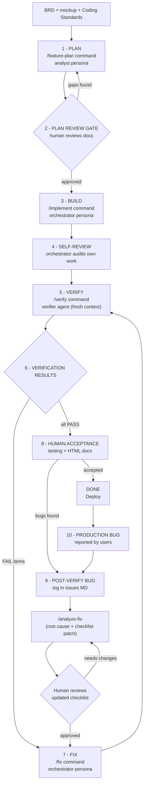

# AI-First Development Playbook — Team Edition

[](https://www.npmjs.com/package/@techierathore/ai-first-playbook)

Published on npm as
[`@techierathore/ai-first-playbook`](https://www.npmjs.com/package/@techierathore/ai-first-playbook).

**Spec → Build → Verify.** A lean, repeatable process for spec-driven AI development in a
team — engineered to close the verification gap, enforce cross-cutting rules, and make
every document readable by both the model and the humans.

> This is the **team edition** of a two-edition family.
> The **solo edition** is [TechieFlow](https://github.com/techierathore/TechieFlow) —
> one philosophy at two scales.

---

## Read in this order

| # | Read | For |
|---|---|---|
| 1 | [Getting Started](docs/Getting-Started.md) | Install, profile, secrets, first smoke test, quick paths |
| 2 | [How It Works](docs/Playbook-How-It-Works.md) | The ten phases in plain English |
| 3 | [Phases](phases/) | One page per phase: inputs, outputs, gate |
| 4 | [Templates](templates/) | Checklist item, deployment steps, Issues file, handoffs, command specifications |
| 5 | [Operating Guide](docs/Operating-Guide.md) | Roles, gates, handoffs, commands, scripts, telemetry, measures, YOLO, troubleshooting |

Worked examples for training: [greenfield](docs/examples/Greenfield-Case-Study.md) and
[brownfield](docs/examples/Brownfield-Case-Study.md). Rolling out to a team:
[onboarding/first-week.md](onboarding/first-week.md).

## Install

```bash
cd /path/to/your/project
npx @techierathore/ai-first-playbook@latest install --dry-run
npx @techierathore/ai-first-playbook@latest install
```

Requires Node.js 22.14.0+, npm 11.5.1+ and OpenCode. Only `.opencode/`, `.playbook/` and a managed
`.gitignore` block reach the project. Upgrade, uninstall and source-clone installs are in
[Getting Started](docs/Getting-Started.md#2-install).

## The problem

AI coding agents implement a checklist, then *declare* themselves done. Three structural
gaps sit behind the bugs that leak:

1. **There is no closed verification loop — you are the loop.** Nothing independent
   re-derives expected behaviour from the spec and checks the artifact. The agent that
   wrote the code cannot reliably check it.
2. **Cross-cutting rules live inside long per-feature docs the model deprioritises.**
   Logging, error handling, coding standards, and UI fidelity slide under context
   pressure.
3. **Commands don’t enforce context gathering.** When context is missing, the AI guesses
   wrong. Commands must *ask* for what they need.

The reframe this playbook is built on: *you do not have an AI quality problem — you have
a missing process step, unenforced standards, and insufficient context enforcement.* Move
the verification loop into the system, promote ambient rules to always-on context, and
make commands demand their inputs.

## The lifecycle at a glance

Ten steps, four gates (gates in orange). One file per step under [`phases/`](phases).


```mermaid
flowchart TD
    A["BRD + mockup + Coding Standards"] --> B["1 - PLAN\n/feature-plan command\nanalyst persona"]
    B --> C{"2 - PLAN REVIEW GATE\nhuman reviews docs"}
    C -- "gaps found" --> B
    C -- "approved" --> D["3 - BUILD\n/implement command\norchestrator persona"]
    D --> E["4 - SELF-REVIEW\norchestrator audits own work"]
    E --> F["5 - VERIFY\n/verify command\nverifier agent (fresh context)"]
    F --> G{"6 - VERIFICATION RESULTS"}
    G -- "FAIL items" --> H["7 - FIX\n/fix command\norchestrator persona"]
    H --> F
    G -- "all PASS" --> I["8 - HUMAN ACCEPTANCE\ntesting + HTML docs"]
    I -- "bugs found" --> K["9 - POST-VERIFY BUG\nlog in issues MD"]
    K --> L["/analyze-fix\n(root cause + checklist patch)"]
    L --> M{"Human reviews\nupdated checklist"}
    M -- "needs changes" --> L
    M -- "approved" --> H
    I -- "accepted" --> N["DONE\nDeploy"]
    N --> O["10 - PRODUCTION BUG\nreported by users"]
    O --> K
```

| # | Step | Driven by | In one line |
|---|------|-----------|-------------|
| 1 | [Plan](phases/01-plan.md) | `/feature-plan` (analyst) | Produce the full verifiable document set; the command asks for every missing input |
| 2 | [Plan Review **gate**](phases/02-plan-review-gate.md) | human | Cheap to fix a plan; expensive to fix built code |
| 3 | [Build](phases/03-build.md) | `/implement` (orchestrator) | Parallel sub-agents build from the checklist with standing rules always in context |
| 4 | [Self-review](phases/04-self-review.md) | orchestrator | Re-read checklist vs own diff; build + smoke test before declaring done |
| 5 | [Verify **gate**](phases/05-verify.md) | `/verify` (Verifier agent) | Fresh-context independent audit that *executes* the code — the keystone |
| 6 | [Verification results **gate**](phases/06-verification-results-gate.md) | Verifier output | PASS/FAIL/DATA-GAP/BLOCKED per item with evidence, annotated inline in the checklist |
| 7 | [Fix](phases/07-fix.md) | `/fix` (orchestrator) | Fix only the FAIL items; loop back to Verify until clean |
| 8 | [Human acceptance](phases/08-human-acceptance.md) | you / QA / BA | Manual testing for what automated checks can't catch |
| 9 | [Post-verification bugs **gate**](phases/09-post-verification-bugs.md) | `/analyze-fix` (analyst) | Root-cause *why the Verifier missed it*; every escaped bug tightens the checklist |
| 10 | [Production bugs](phases/10-production-bugs.md) | `/analyze-fix` → `/fix` → `/verify` | Same loop; the checklist accumulates every real-world failure as a verifiable item |

## The Verifier — the keystone

A **fresh-context, independent agent** (it did not write the code, so it has no reason to
believe the work is done) that must prove every claim by **running the real code path and
observing the real side effect**:

- **Playwright MCP** for web UI: checks every mockup element via the accessibility tree,
  takes screenshots. Code audit is the explicit *last resort*, never the default.
- **dotnet integration tests and runner consoles** it writes itself under
  `verification/` — builds the app's host, triggers the real sync/job, opens a real
  `SqlConnection` using the app's own config, asserts the view actually populated,
  greps the real logs for the required INFO lines.
- **Environment probing + real config only**: `command -v` for every tool it needs;
  connection strings from `appsettings.Development.json` — never invented, never logged.
- **Three forbidden excuses**: "no SQL access", "can't run the web app", "can't run the
  Windows app". Each has a prescribed workaround; only the human may authorize skipping.
- Verdicts: `PASS`, `FAIL`, `PASS (code-audit)`, `FAIL (code-audit)`, `DATA-GAP`, `BLOCKED` — written
  inline in the checklist with evidence. *"A 200 response with zero rows written is a
  FAIL, not a pass."*

Full spec: [`templates/verifier-agent.md`](templates/verifier-agent.md) and
[`phases/05-verify.md`](phases/05-verify.md). The **runnable agent** — all 1,050 lines of
probes, anti-excuse rules, and verdict discipline — is
[`harness/opencode/agent/verifier.md`](harness/opencode/agent/verifier.md).

## The command library

**Four commands carry the daily loop**; eleven more support it. Specs (one file per
command) live in [`templates/commands/`](templates/commands); the **runnable command
files** are in [`harness/opencode/command/`](harness/opencode/command).

| Core loop | What it does |
|---|---|
| `/feature-plan` | Analyst produces the full verifiable document set from BRD + mockup + standards |
| `/implement` | Orchestrator builds from the checklist with parallel sub-agents + smoke-test self-check |
| `/verify` | Independent Verifier audits by execution; annotates PASS/FAIL inline |
| `/fix` | Orchestrator fixes FAIL-annotated items only; re-verify until ALL PASS |

Supporting: `/analyze-fix`, `/add-doc`, `/refresh-doc`, `/upgrade-docs`,
`/create-issue-list`, `/amend-checklist`, `/archive-checklist`, `/generate-html`,
`/update-context`, `/legacy-audit`, `/log-miss`. `/log-miss` is the quick between-phase
front door: classify and append a durable record without booting or reproducing the app.

## What is checked by a script

The Playbook keeps its own requirement list, [docs/Playbook-Requirements.md](docs/Playbook-Requirements.md),
and a grader that runs every line: `node scripts/playbook-grade.mjs docs/Playbook-Requirements.md`
prints `N of M graded` and appends one verdict per requirement to
`verification/telemetry/grades.ndjson`. Rules a script enforces are not repeated as prose.

## For maintainers

Source layout, design decisions, telemetry contracts, YOLO supervision, model routing, the WSL
setup and the npm release procedure live under [docs/maintainer/](docs/maintainer/). The runnable
OpenCode files are in [harness/](harness/) ([harness/README.md](harness/README.md)); runtime scripts
are in [scripts/](scripts/) and their checks in [tests/](tests/). Superseded documents are kept in
`docs/archive/`.

This is the team edition; the solo edition is
[TechieFlow](https://github.com/techierathore/TechieFlow) — one philosophy at two scales.

## Attribution

Built on [OpenCode](https://opencode.ai), with persona agents from
[BMAD-METHOD](https://github.com/bmad-code-org/BMAD-METHOD) (MIT). BMAD content is
**referenced, not redistributed** — this repo ships only original work (the command
library, the Verifier agent, the guardrails plugin, the templates, the doc-shell, and the
process itself). If you want the personas, install BMAD from upstream; see
[`harness/README.md`](harness/README.md#personas) for the alternatives.

## License

[Apache-2.0](LICENSE) — same license as TechieFlow, by design.
