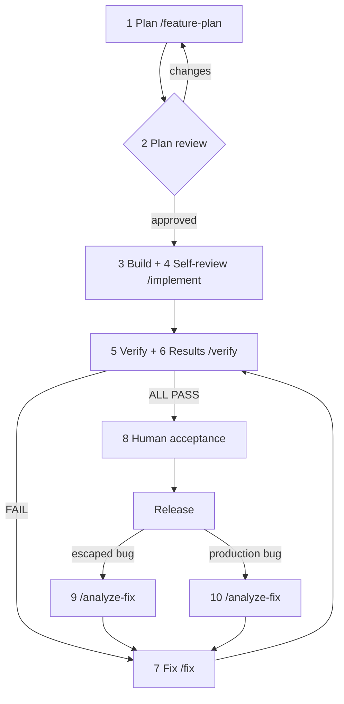

# Getting Started with the AI-First Playbook

Audience: anyone bringing the Playbook into a new or existing repository. Read this first, then
[Playbook-How-It-Works.md](Playbook-How-It-Works.md) for the ten phases and
[Operating-Guide.md](Operating-Guide.md) for day-to-day operation.

## 1. What it is

A spec-driven team workflow for OpenCode: plan against explicit inputs, build from one living
checklist, verify independently by executing the real behaviour, and feed every escape back into
that checklist. Markdown is the source of truth; HTML is a convenience for human readers.



## 2. Install

Requires Node.js 22.14.0+ and npm 11.5.1+, OpenCode 1.18.32 or 2.0.18 (`package.json`
`opencode.supported`), and your application's own toolchain; the Playbook installs none of that.
If a session opens with `PLAYBOOK GUARDS NOT LOADED`, rerun the install with `--force` and restart
OpenCode.
On Windows, run everything inside WSL with repositories under `~/work`
([WSL guide](maintainer/OpenCode-WSL-Setup-Guide.md)).

From the application project root:

```bash
npx @techierathore/ai-first-playbook@latest install --dry-run   # preview
npx @techierathore/ai-first-playbook@latest install
```

The install writes only `.opencode/` (commands, agents, plugins, templates), `.playbook/` (standing
rules, profile, schemas, runtime scripts, install record) and a managed `.gitignore` block. It adds
no `node_modules` or package metadata; `npm i @techierathore/ai-first-playbook` is accepted and
cleans up after itself, but `npx … install` is the supported form.

| Task | Command |
|---|---|
| Offline guides under `.playbook/guides/` | `npx @techierathore/ai-first-playbook@latest install --with-guides` |
| Upgrade (review the dry run first) | `npx … install --dry-run --force`, then `npx … install --force` |
| Uninstall | `npx … uninstall --dry-run`, then `npx … uninstall --force` |
| From a source clone | `node <clone>/scripts/install.mjs install --target=/abs/path/to/project` |

`--force` replaces or removes only files recorded in `.playbook/installation.json`; unowned files
are always kept. After installing, restart OpenCode in the project root.

## 3. Before the first command

1. **Profile.** Replace every placeholder in `.playbook/environment-profile.yml`: topology,
   commands, URLs, database method, browser endpoint, logs, secret channels. Then run
   `node .playbook/scripts/playbook-probe.mjs`; every line should read `ok`.
2. **Secrets.** Only an approved secret manager, an environment reference, protected stdin or a
   protected temporary file — never arguments, Markdown, logs, URLs or evidence.
3. **Standing rules.** `.playbook/AGENTS.md` is loaded into every agent. The approved checklist is
   authoritative over chat; the Verifier writes results only inside it.
4. **Telemetry.** Keep `/verification/telemetry/events.ndjson` (transient) and `/verification/runs/`
   (raw evidence, swept after 7 days) ignored; commit `verification/telemetry/misses.ndjson`. Never
   ignore the whole `verification/telemetry/` folder. Start with `PLAYBOOK_TELEMETRY=1 opencode`
   when you want metrics.
5. **Inputs and owners.** Have the requirements source, the mockup for UI work, the coding
   standards, and named owners for plan approval, acceptance, release and escalation.

## 4. First smoke test

Before trusting the Playbook on real work:

1. Pick a disposable feature that runs under the profile and plant one deterministic defect (for
   example an import that reports success while writing no rows).
2. Write one checklist item whose Acceptance and Verify lines demand the correct observable result
   (`checklist-lint.mjs` must pass).
3. Run `/verify @docs/<Feature>-Implementation-Checklist.md`. Expect an inline
   `**Verifier Result**: FAIL` with executed evidence, an updated Status Table and Run Log,
   evidence under `verification/`, no separate report file and no product-code edit.
4. Run `/fix`, then a fresh `/verify`; the item reaches PASS only after the runtime check passes.

`DATA-GAP` (seed data missing) and `BLOCKED` (could not run) do not prove the defect was caught:
fix the setup and repeat.

## 5. Quick paths

**New project.** Install and set up (§2–3) → smoke test (§4) → `/feature-plan` → human plan
approval → `/implement` → fresh `/verify` → `/fix` until ALL PASS → acceptance, release,
post-deploy checks, ownership transfer. Worked example:
[examples/Greenfield-Case-Study.md](examples/Greenfield-Case-Study.md).

**Existing project.** Install without overwriting; fill the profile from observed commands;
`/legacy-audit` to baseline behaviour before any change; `/feature-plan` with regression items for
everything that must not change; then the same loop. Worked example:
[examples/Brownfield-Case-Study.md](examples/Brownfield-Case-Study.md).

## 6. Where next

| Read | For |
|---|---|
| [Playbook-How-It-Works.md](Playbook-How-It-Works.md) | The ten phases in plain English |
| [phases/](../phases/) | One page per phase: inputs, outputs, gate |
| [templates/](../templates/) | Checklist item, deployment steps, Issues file, handoffs and command specifications |
| [Operating-Guide.md](Operating-Guide.md) | Roles, gates, handoffs, commands, scripts, telemetry, measures, YOLO, troubleshooting |
