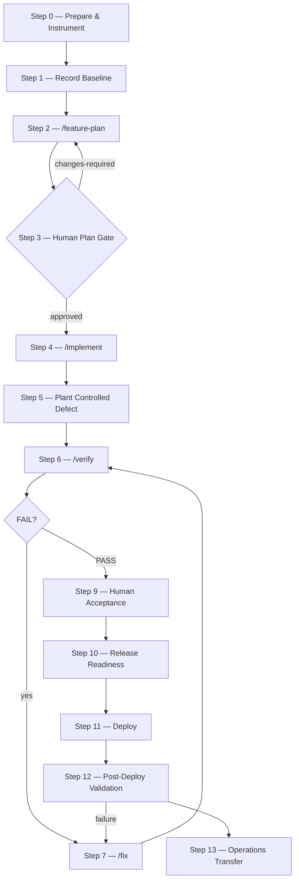

# Greenfield Project Runbook: Team Inventory

## 1. Objective and illustrative boundary

Use this runbook to repeat the AI-First Playbook lifecycle in a new repository: prepare inputs,
establish an honest baseline, plan, approve, implement, independently verify, fix, accept,
release, validate and transfer ownership. The implementation checklist is the durable
build-and-verify contract; chat is not the system of record.

**Worked example:** Team Inventory lets an authorized operations user locate a synthetic asset,
its synthetic owner and audit history, and import synthetic CSV records. The duplicate asset-tag
scenario is a controlled training defect. **The app, database, mockup, CSV fixtures, users,
credentials and defect patch are illustrative and are not shipped with this Playbook.** Each team
must provide an authorized disposable repository and its own synthetic fixtures.

This runbook does not prescribe an app stack, database, command, port or deployment platform.
Every operational value comes from the target's `.playbook/environment-profile.yml`.

## 2. SDLC-to-AIFP phase mapping

The table below maps every conventional SDLC stage to the exact AIFP phase, command, agent,
inputs, outputs, gate and expected metrics.

| SDLC Stage | AIFP Phase | Command | Agent | Inputs | Outputs | Gate | Metrics |
|---|---|---|---|---|---|---|---|
| Requirements Analysis | [Phase 1 — Plan](../phases/01-plan.md) | `/feature-plan` | Analyst | BRD, mockup, standards, DB arch, profile | Checklist, architecture, DB changes | [Phase 2 — Plan Review](../phases/02-plan-review-gate.md) human gate | `feature-plan` |
| Design | [Phase 1 — Plan](../phases/01-plan.md) (continued) | `/feature-plan` | Analyst | Same as above | Architecture, ER diagram, verification guide | Plan approval packet | `feature-plan` |
| Development | [Phase 3 — Build](../phases/03-build.md) + [Phase 4 — Self-Review](../phases/04-self-review.md) | `/implement` | Orchestrator → Builders | Approved checklist, standards | Code, tests, scripts, Status Table | implementation-summary | `implement` |
| Testing/Verification | [Phase 5 — Verify](../phases/05-verify.md) + [Phase 6 — Results Gate](../phases/06-verification-results-gate.md) | `/verify` | Fresh Verifier | Checklist, guides, profile | Evidence, inline verdicts, Run Log | verification-results | `verify` |
| Bug Fixing | [Phase 7 — Fix](../phases/07-fix.md) | `/fix` | Orchestrator → Builders | FAIL items, checklist | Fixed code, self-test | Fresh `/verify` | `fix` |
| Acceptance | [Phase 8 — Human Acceptance](../phases/08-human-acceptance.md) | Human gate | QA/Product | PASS checklist, evidence | `acceptance.md` | Human approval | None (process metric) |
| Release | Human gate | Release team | Acceptance, checklist | `release-readiness.md` | Release approval | None (process metric) | None (process metric) |
| Maintenance | [Phase 9](../phases/09-post-verification-bugs.md) / [Phase 10](../phases/10-production-bugs.md) | `/analyze-fix` | Analyst | Issues, code | Updated checklist | `analyze-fix` | `miss` / `miss-fix` |

## 3. Greenfield lifecycle flow



## 4. Audience and roles

**Audience:** Product/Business Analysis, Engineering, QA, Security, Release and Operations.

| Role | Responsibility |
|---|---|
| Facilitator | Own synthetic safety, controlled defect, pacing and debrief. |
| Product owner | Supplies intent and resolves requirement questions. |
| Engineering owner | Owns repository, architecture, standards and profile validity. |
| Analyst agent | Runs `/feature-plan`; produces the traceable document set. |
| Plan approvers | Product, Engineering, QA and Security approve/reject the plan. |
| Orchestrator agent | Runs `/implement` and `/fix`; delegates and aggregates waves. |
| Builder subagents | Implement only assigned checklist slices. |
| Verifier agent | Runs `/verify` in fresh context; writes results and miss telemetry. |
| QA/Product | Perform human acceptance. |
| Release owner | Owns release decision, rollout and rollback authority. |
| Operations owner | Accepts monitoring, recovery, support and ownership. |
| Telemetry steward | Exports, filters, checkpoints and hands data to TfLens. |

One person may hold several human roles, but each handoff names producer, consumer, accountable
approver, identity, UTC timestamp, transition, evidence, open decisions, escalation owner and
exception expiry.

## 5. Prerequisites

- An authorized disposable greenfield repository.
- Supported Node.js/npm and OpenCode; install/restart as described in `docs/Installation.md`.
- A fully populated `.playbook/environment-profile.yml` with no `<replace: ...>` values.
- Engineering-validated profile build, test, start, cleanup, URLs, database method and log paths.
- Repository coding standards and approved DB architecture decisions.
- Approved local/non-production resources for the declared topology.
- Product, QA, Security, Release and Operations representatives for their gates.
- Secrets supplied only through an approved manager, protected stdin or protected temporary file;
  never in prompts, arguments, Markdown, URLs, logs or evidence.
- A Git rule that ignores only `/verification/telemetry/events.ndjson`.

Install after any policy-required dry run:

```bash
npx @techierathore/ai-first-playbook@latest --target="/absolute/path/to/training-repository"
```

The installer does not create Team Inventory, fixtures, secrets or running services.

## 6. Synthetic-only preparation

1. Invent all people, emails, departments, assets, tags, audit events and CSV rows.
2. Never copy production data, credentials, customer identifiers or personal data.
3. Mark and restrict the environment as non-production.
4. Prepare an ordinary asset, one with audit history, an unknown asset and two CSV rows sharing a
   tag. Keep actual values in the approved fixture, not this generic document.
5. Define duplicate behavior in the spec — for example, atomic rejection with an actionable,
   non-secret error and no partial success. Do not leave expected behavior implicit.
6. The facilitator retains an organization-owned, reviewed way to introduce the defect after
   self-review. It may be a patch or manual edit; neither is supplied here.
7. Record fixture provenance, approval and profile-based reset instructions.

## 7. Exact input pack before `/feature-plan`

Do not plan until all six are available:

1. **BRD/spec:** one authoritative BRD or project/integration specification covering actors,
   authorization, audit, import/error behavior, retention, constraints and acceptance.
2. **Optional UI mockup:** required when UI is in scope; provide TSX/image/design export and visible
   states. Explicitly say "no UI" when applicable.
3. **Standards:** actual coding-standards path, including test, logging, security, errors and naming.
4. **DB architecture:** approved data/migration/compatibility/rollback architecture path, or an
   explicit "no database scope" decision.
5. **Environment profile:** validated `.playbook/environment-profile.yml`.
6. **Naming/output decisions:** display name, slug, project prefix, docs folder, exact checklist
   name, run-ID convention, evidence path and deploy path.

Chosen example decisions (choices, not Playbook defaults):

```text
Feature / slug: Team Inventory / team-inventory
Docs: docs/team-inventory/
Checklist: docs/team-inventory/Team-Inventory-FullStack-Implementation-Checklist.md
Evidence: verification/team-inventory/<run-id>/
Deploy: deploy/team-inventory/
```

Also supply every existing project file referenced by the inputs. Missing requirements authority
stops planning; an explicit "backend only; no mockup" decision does not.

## 8. OpenCode telemetry and retention

Telemetry activation is a process-start decision. From the target root, set the flag **before**
starting OpenCode:

```bash
PLAYBOOK_TELEMETRY=1 opencode
```

Setting it after startup is too late; restart OpenCode. Without it, the plugin registers nothing.
Capture is best-effort and must never block delivery.

- `verification/telemetry/events.ndjson` is transient. Ignore it in Git; checkpoint completed
  executions before rotation, then rotate under policy.
- `verification/telemetry/misses.ndjson` is durable and append-only. Never rotate, rewrite or
  broadly ignore it. Human owners retain/commit it under review; agents do not commit.
- Never ignore `verification/telemetry/` or `*.ndjson`.
- Upsert phase rows by `phase_execution_id`; re-export is expected and must be idempotent.
- Retain repository identity, source schema/harness, importer version and import timestamp.

## 9. Honest greenfield baseline

Record before feature work:

- existing revision (`git rev-parse HEAD`) and clean/intentionally dirty status;
- profile-declared build/test results, including "not available" for a scaffold with no target;
- profile validity and approved synthetic infrastructure/reset readiness;
- zero feature-related command-phase executions in the selected pre-feature cohort; and
- zero Team Inventory miss lifecycle records in that cohort.

This is a readiness/cohort baseline, **not** a pre-existing Team Inventory behavior baseline. Do
not turn missing tests or telemetry into passing zeros. No Git tag is required; if policy uses a
baseline tag, a human/release process creates it — not an agent in this run.

## 10. Artifact tree

```text
docs/team-inventory/
  Team-Inventory-BRD-or-Spec.md
  Team-Inventory-{DB-Changes,Architecture,Developer-Flow-Guide,Verification-Guide}.md
  Team-Inventory-FullStack-Implementation-Checklist.md
  handoffs/{plan-approval,implementation-summary,verification-results}.md
  handoffs/{acceptance,release-readiness,operations-transfer}.md
verification/
  team-inventory/<run-id>/{environment.json,phase-metrics.ndjson,miss-lifecycle-export.ndjson}
  team-inventory/<run-id>/<runtime evidence named by the checklist>
  telemetry/{events.ndjson,misses.ndjson}
deploy/team-inventory/<stack-appropriate deploy and rollback artifacts, only if required>
```

Feature docs/handoffs belong in the chosen docs folder. Runtime evidence belongs at repository-root
`verification/<feature>/<run-id>/`, never under docs. Do not invent a migration format.

## 11. Conceptual phases and command metrics

| Command phase | Conceptual work combined into it |
|---|---|
| `feature-plan` | [Phase 1 — Plan](../phases/01-plan.md) |
| `implement` | [Phase 3 — Build](../phases/03-build.md) + [Phase 4 — Self-Review](../phases/04-self-review.md) |
| `verify` | [Phase 5 — Verify](../phases/05-verify.md) + [Phase 6 — Results Gate](../phases/06-verification-results-gate.md) |
| `fix` | [Phase 7 — Fix](../phases/07-fix.md) |
| `analyze-fix` | [Phase 9 — Post-Verification Bugs](../phases/09-post-verification-bugs.md) / [Phase 10 — Production Bugs](../phases/10-production-bugs.md) |

Human plan review, acceptance, release, deploy and transfer produce no phase row unless an
instrumented slash command actually runs. Label the dimension **Command phase**; never split a
command window by guessed token percentages.

## 12. Executable SDLC — step-by-step runbook

### Step 0 — Prepare and instrument

- **SDLC stage:** Project initialization / Environment setup.
- **AIFP phase:** Pre-phase preparation (no instrumented command).
- **Responsible:** Engineering owner, facilitator, telemetry steward.
- **Inputs:** Authorized repo, installed Playbook, synthetic approval, input paths.
- **Command:**
  ```bash
  PLAYBOOK_TELEMETRY=1 opencode
  ```
- **Expected outputs/artifacts:** Completed `.playbook/environment-profile.yml`, retention review,
  fixture approval record, session UTC start timestamp.
- **Gate/exit criteria:** No placeholders, secrets, production data or guessed topology values.
  Profile must contain zero `<replace: ...>` entries.
- **Metrics generated:** None — metrics begin with the first instrumented slash command.

### Step 1 — Record baseline

- **SDLC stage:** Baseline / Readiness gate.
- **AIFP phase:** Pre-phase baseline (no instrumented command).
- **Responsible:** Engineering records; QA witnesses.
- **Inputs:** Revision, profile, scaffold and empty feature cohort.
- **Command:**
  ```bash
  git rev-parse HEAD
  git status --short
  # then run the profile's exact build, test and cleanup commands
  ```
- **Expected outputs/artifacts:** UTC note with revision/status, actual build/test outcomes,
  profile validity confirmation, empty cohort record.
- **Gate/exit criteria:** Reproducible readiness or owner-named blocker; no product-behavior claim.
  Empty scaffold reports "not available", never fabricated PASS.
- **Metrics generated:** None — these are operator commands, not Playbook command phases.

### Step 2 — Plan (SDLC: Requirements Analysis + Design)

- **SDLC stage:** Requirements Analysis and Design.
- **AIFP phase:** [Phase 1 — Plan](../phases/01-plan.md).
- **Responsible:** Product supplies intent; Analyst agent produces documents.
- **Inputs:** All six pack elements (BRD, mockup, standards, DB arch, profile, naming decisions)
  and referenced project files.
- **Command:**
  ```text
  /feature-plan @docs/team-inventory/Team-Inventory-BRD-or-Spec.md
  @<mockup-if-UI> @<coding-standards> @<db-architecture>
  @.playbook/environment-profile.yml
  Output to docs/team-inventory/. Use prefix Team-Inventory and the selected checklist name.
  Map every requirement/mockup state; define duplicate atomicity, auth, audit and logging.
  Use synthetic verification. Markdown only.
  ```
- **Expected outputs/artifacts:** Traceable architecture, DB changes, developer flow guide,
  verification guide and a seven-field-plus-Type checklist with Status Table, dependencies,
  Infrastructure, Deployment and Verifier Run Log.
- **Gate/exit criteria:** Every requirement maps to a verifiable checklist item; unresolved
  decisions carry owner and due date.
- **Metrics generated:** One completed `feature-plan` row.

### Step 3 — Human plan gate (SDLC: Design Review)

- **SDLC stage:** Design review / Approval.
- **AIFP phase:** [Phase 2 — Plan Review Gate](../phases/02-plan-review-gate.md).
- **Responsible:** Product, Engineering, QA, Security; named accountable approver.
- **Inputs:** Full plan set, traceability matrix, coding standards and open decisions.
- **Command:** No slash command. Fill `docs/team-inventory/handoffs/plan-approval.md` from
  `templates/handoffs/plan-approval.md`.
- **Expected outputs/artifacts:** `approved` or `changes-required` verdict with identities, UTC
  timestamp, evidence links, escalation owner and exception expiry.
- **Gate/exit criteria:** Only `approved` enters build; `changes-required` returns to Step 2
  with full history preserved.
- **Metrics generated:** None — human gate.

### Step 4 — Implement and self-review (SDLC: Development)

- **SDLC stage:** Development / Implementation.
- **AIFP phase:** [Phase 3 — Build](../phases/03-build.md) + [Phase 4 — Self-Review](../phases/04-self-review.md).
- **Responsible:** Orchestrator, builder subagents, Engineering owner.
- **Inputs:** Approved checklist, coding standards, architecture/DB docs and environment profile.
- **Command:**
  ```text
  /implement docs/team-inventory/Team-Inventory-FullStack-Implementation-Checklist.md
  Follow <coding-standards>. Use profile commands and synthetic fixtures only.
  Finish the whole checklist, persist the implementation handoff and do not commit.
  ```
- **Expected outputs/artifacts:** Wave plan, updated Status Table, source and deploy changes,
  build/test/smoke evidence, logging and cleanup evidence, populated Infrastructure and
  Deployment sections, implementation summary handoff.
- **Gate/exit criteria:** Every item is `to-verify` after self-review, or carries an
  owner-annotated blocker (e.g. `[EXTERNAL BLOCKER]`).
- **Metrics generated:** One completed `implement` row covering build and embedded self-review.

### Step 5 — Plant the controlled duplicate-tag defect

- **SDLC stage:** In-sprint defect injection (training exercise only).
- **AIFP phase:** Human source edit (no instrumented command).
- **Responsible:** Facilitator, witnessed by Engineering.
- **Inputs:** Self-reviewed implementation and organization-owned reviewed patch/edit.
- **Command:** No universal command. Use the approved repository procedure; make duplicate CSV
  import report success while writing zero rows. Record the actual procedure privately.
- **Expected outputs/artifacts:** UTC injection record, affected item and synthetic fixture ID.
  No fix disclosure to builders or verifiers.
- **Gate/exit criteria:** Build succeeds, change is reversible and only intended synthetic
  behavior changed.
- **Metrics generated:** None — human source edit.

### Step 6 — Fresh independent verify (SDLC: Testing/Verification)

- **SDLC stage:** Testing / Independent verification.
- **AIFP phase:** [Phase 5 — Verify](../phases/05-verify.md) + [Phase 6 — Results Gate](../phases/06-verification-results-gate.md).
- **Responsible:** Verifier agent; QA observes; facilitator gives no hint.
- **Inputs:** Checklist, verification guide, DB changes guide, environment profile and
  reset synthetic state.
- **Command:**
  ```text
  /verify docs/team-inventory/Team-Inventory-FullStack-Implementation-Checklist.md
  docs/team-inventory/Team-Inventory-Verification-Guide.md
  docs/team-inventory/Team-Inventory-DB-Changes.md
  Verify every item as written using the profile and repository-root evidence.
  ```
- **Expected outputs/artifacts:** Runtime evidence under `verification/team-inventory/<run-id>/`,
  inline Verifier Results, updated Status Table and Run Log, `handoffs/verification-results.md`.
  Verifier cannot write product source.
- **Gate/exit criteria:** Expected exercise outcome is `FAIL` (the planted defect). `DATA-GAP` /
  `BLOCKED` also blocks acceptance.
- **Metrics generated:** One completed `verify` row, including linked verifier children.

### Step 7 — Fix every failure (SDLC: Bug Fixing)

- **SDLC stage:** Bug fixing / Defect remediation.
- **AIFP phase:** [Phase 7 — Fix](../phases/07-fix.md).
- **Responsible:** Orchestrator and scoped builder subagents.
- **Inputs:** Inline failures from verifier, Status Table, latest run evidence, coding standards
  and evidence directory.
- **Command:**
  ```text
  /fix docs/team-inventory/Team-Inventory-FullStack-Implementation-Checklist.md
  Fix every active failure, preserve duplicate atomicity, self-test the complete FAIL set,
  leave repaired items Fixed — awaiting re-verify, and do not commit.
  ```
- **Expected outputs/artifacts:** Fix waves, root cause annotations below each verifier result,
  updated code/tests/docs, smoke test evidence.
- **Gate/exit criteria:** Full FAIL set repaired and self-tested, or genuinely externally blocked
  with owner annotation. No fake PASS.
- **Metrics generated:** One completed `fix` row per attempt.

### Step 8 — Re-verify and loop (SDLC: Regression Testing)

- **SDLC stage:** Regression testing / Re-verification.
- **AIFP phase:** [Phase 5 — Verify](../phases/05-verify.md) (repeat).
- **Responsible:** Fresh Verifier; Orchestrator only if another fix cycle is needed.
- **Inputs:** Repaired state, new run ID, unchanged verification criteria and reset fixtures.
- **Command:** Repeat Step 6 `/verify`; on FAIL / DATA-GAP / BLOCKED return to Step 7.
- **Expected outputs/artifacts:** New root evidence directory; preserved prior runs; appended
  results and Run Log.
- **Gate/exit criteria:** Every item and overall result PASS; no relevant open data gap.
- **Metrics generated:** Distinct completed `verify` row per attempt; never overwrite a failed
  execution record.

### Step 9 — Human acceptance (SDLC: Acceptance Testing)

- **SDLC stage:** Acceptance testing / Sign-off.
- **AIFP phase:** [Phase 8 — Human Acceptance](../phases/08-human-acceptance.md).
- **Responsible:** QA/Product acceptance owner; Release consumes.
- **Inputs:** PASS checklist, Verification Guide, result handoff and runtime evidence.
- **Command:** Execute the verification guide with profile values; fill
  `handoffs/acceptance.md` from `templates/handoffs/acceptance.md`.
- **Expected outputs/artifacts:** Manual verification links, differences noted, identity, UTC
  decision, expiring exceptions.
- **Gate/exit criteria:** Accepted or accepted-with-expiring-exception; rejection returns to
  fix/re-verify loop.
- **Metrics generated:** None — human gate.

### Step 10 — Release readiness (SDLC: Release Preparation)

- **SDLC stage:** Release preparation / Go/no-go.
- **AIFP phase:** Human gate (no instrumented command).
- **Responsible:** Release/rollback authority with Engineering, Security and Operations.
- **Inputs:** Acceptance result, PASS checklist, Deployment/Infrastructure sections,
  compatibility evidence, monitoring and rollback plans.
- **Command:** Fill `handoffs/release-readiness.md` from
  `templates/handoffs/release-readiness.md`. No slash command.
- **Expected outputs/artifacts:** Approvals, deployment order, feature flags, recovery plan,
  rollback procedure, monitoring signals, thresholds and pre-flight checks.
- **Gate/exit criteria:** Named decision; unresolved failure, data gap, infrastructure or
  rollback gap blocks release.
- **Metrics generated:** None.

### Step 11 — Deploy (SDLC: Deployment)

- **SDLC stage:** Deployment / Release execution.
- **AIFP phase:** Human gate (no instrumented command unless deployment is wrapped in a
  Playbook command).
- **Responsible:** Release owner executes; rollback authority supervises; Operations observes.
- **Inputs:** Approved readiness record and `deploy/team-inventory/` files if required.
- **Command:** Run only Deployment Steps / profile commands. This runbook supplies no app
  command, migration tool, target, URL or port.
- **Expected outputs/artifacts:** Deployment reference, revision/environment captured,
  deployment order/outcome, flag state and recovery record.
- **Gate/exit criteria:** Approved order succeeds; critical failure pauses and invokes
  rollback/escalation.
- **Metrics generated:** None unless an instrumented Playbook command wraps deployment.

### Step 12 — Post-deploy validation (SDLC: Maintenance / Monitoring)

- **SDLC stage:** Post-deployment validation / Operations handoff readiness.
- **AIFP phase:** [Phase 9 — Post-Verification Bugs](../phases/09-post-verification-bugs.md) /
  [Phase 10 — Production Bugs](../phases/10-production-bugs.md) when formal analysis is needed.
- **Responsible:** Operations and QA; Release decides continue/rollback.
- **Inputs:** Release record, revision, thresholds and post-deploy checks.
- **Command:** Use only profile/release health, smoke, log and cleanup commands. Use synthetic
  writes only in an approved target. If a defect is found, use:
  ```text
  /analyze-fix <issue-description-or-link>
  ```
- **Expected outputs/artifacts:** Health check results, duplicate atomicity confirmed,
  monitoring/log evidence, incident/decision record.
- **Gate/exit criteria:** Critical checks pass; otherwise pause/rollback, analyze, fix,
  fresh-verify and repeat the impacted acceptance/readiness/deploy steps.
- **Metrics generated:** `analyze-fix` row when `/analyze-fix` runs; none for manual checks.

### Step 13 — Operations transfer (SDLC: Maintenance / Handoff)

- **SDLC stage:** Operations handoff / Knowledge transfer.
- **AIFP phase:** Human gate (no instrumented command).
- **Responsible:** Release produces; incoming Operations owner accepts.
- **Inputs:** Final checklist/evidence, release result, dashboards, alerts, runbook, open work.
- **Command:** Fill `handoffs/operations-transfer.md` from
  `templates/handoffs/operations-transfer.md`. No slash command.
- **Expected outputs/artifacts:** Identities, support contacts, deploy/rollback procedures,
  latest run summary, risks, next action with due date.
- **Gate/exit criteria:** Successor finds status, monitoring, escalation and rollback
  procedures without requiring the original author's context.
- **Metrics generated:** None.

## 13. Export, quality filter and TfLens handoff

After the final command reaches idle, export from the target root:

```bash
node .playbook/scripts/playbook-telemetry.mjs \
  --checklist="docs/team-inventory/Team-Inventory-FullStack-Implementation-Checklist.md" \
  > "verification/team-inventory/<run-id>/phase-metrics.ndjson"
node .playbook/scripts/playbook-telemetry.mjs --misses \
  > "verification/team-inventory/<run-id>/miss-lifecycle-export.ndjson"
```

The phase export emits every readable window; bound cohorts by repository, timestamps and retained
execution IDs. The miss export folds amendments and joins exact fix windows without changing the
durable stream; review stderr diagnostics.

Quality rules:

- Elapsed comparisons require `complete:true`; EOF duration remains null.
- Active-time comparisons require `complete:true` and `coverage:"complete"`; partial is a lower bound and unavailable
  is not zero. The comparison value unions overlapping assistant/tool/child intervals.
- Token totals require `complete:true`, `data_quality.valid:true` and `token_status:"complete"`. Preserve all five:
  `input`, `output`, `reasoning`, `cache_read`, `cache_write`.
- Measured cost requires `cost_status:"complete"`. Null is unavailable. Zero with non-zero tokens
  gets the provider-engine caveat and is not "free"; keep estimates separate.
- Use full `models[]` for model mix; `model` is only the dominant compatibility label.
- Show `subagents.spawned` and `contributors`; the difference is non-contributing, not necessarily
  failed. Child usage is already included in phase totals.
- `attempt` and `gate_verdict` are current checklist snapshots applied at export — not historically
  authoritative per-execution outcomes. Preserve run evidence.
- Quarantine invalid rows; never manufacture zeros for absent/unsupported telemetry.

Before rotating `events.ndjson`, verify the approved consumer has upserted every completed
`phase_execution_id`, recorded the checkpoint and retained provenance. Never rotate
`misses.ndjson`. Hand TfLens both exports, repository/cohort identity, checklist, and the renamed
AIFP phase contract `docs/Phase-Efficiency-TfLens-Contract.md` and miss contract
`docs/Miss-Telemetry-TfLens-From-AIFP.md`. TfLens consumes exporter output — not plugin
internals — and preserves null, command-phase and no-per-actor-reporting rules.

## 14. Baseline versus after

Never fabricate values. Report measured values plus supporting `n`, or insufficient data. The
baseline is readiness plus a zero pre-feature phase/miss cohort, not product behavior.

Compare/report: completed elapsed time; complete active effort (not human effort); five token
components; full model mix; measured cost with cost status; spawned/contributing subagents;
command attempts and verdict snapshots with caveat; and miss opened/closed/reopened/backlog.

For miss/fix attribution, headline measured cost-per-miss uses `sole`; show `shared:<n>` only as
separately labelled apportioned cost; exclude `none` rather than converting it to zero. Compare
time-to-close/rework only with adequate provenance and like command phase, scope, harness, project
type, quality and model mix. Fewer than three comparative records is insufficient data.

## 15. Failure routes

| Condition | Route |
|---|---|
| Missing BRD/spec | Product/Analyst supplies authority before planning. |
| UI scope/no mockup | Obtain it or record an owner decision; do not invent UI. |
| Invalid profile | Engineering fixes it before operational commands. |
| Empty scaffold has no build/test | Record unavailable, not PASS; plan the future gate. |
| Plan changes required | Revise in Step 2; repeat approval and preserve history. |
| External implementation dependency | Finish other items; name missing supply and owner. |
| Verify FAIL | `/fix` full FAIL set, then fresh `/verify`. |
| Verify DATA-GAP/BLOCKED | Supply evidence/infrastructure and re-run; do not accept. |
| Acceptance rejected | Amend through approved path, fix and re-verify. |
| Deploy/post-deploy fails | Pause/rollback, preserve evidence, analyze and loop. |
| Telemetry absent | Restart correctly for future phases; never backfill values. |
| EOF phase window | Preserve null duration, checkpoint valid rows, disclose exclusion. |

## 16. Reset and repeat

1. Preserve checklist, handoffs, evidence and append-only miss lifecycle.
2. Export/checkpoint phase records before policy-based transient event rotation.
3. Reverse the controlled defect with the reviewed procedure; do not rewrite history.
4. Reset synthetic state only through the profile mechanism; never guess a DB command.
5. Use a new run ID/evidence directory; never overwrite a prior verifier run.
6. Record new revision/status and cohort boundary.
7. Hold scope constant, or disclose requirement/model/fixture/environment changes.
8. Never delete/resequence miss records to make a repeat look clean.

## 17. Expected final state and debrief

- Docs and six handoffs are under `docs/team-inventory/`; deploy artifacts, if any, under `deploy/`.
- Latest independent verdict is PASS; prior FAIL and each root evidence run remain.
- Duplicate miss has append-only open/fix lifecycle and honest unlinked origin.
- Runtime evidence is under root `verification/team-inventory/<run-id>/`.
- Phase data is quality-filtered/checkpointed; durable misses remain retained.
- Acceptance, readiness, post-deploy result and incoming-owner acceptance are recorded.
- No production data, credential, invented app command or invented port appears.

Debrief from artifacts: Which claim needed fresh runtime evidence? What did self-review prove? Why
was the planted result FAIL rather than PASS/DATA-GAP? Where are failed/fixed evidence and miss
lifecycle? Why do elapsed, complete active effort and human effort differ? Which five token fields
and full model mix support comparison? Why are attempt/verdict snapshots caveated? When is fix cost
`sole`, `shared:<n>` or `none`? What is checkpointed before rotation, and what never rotates? Can a
successor find monitoring, escalation, rollback and the next action without hidden chat context?
