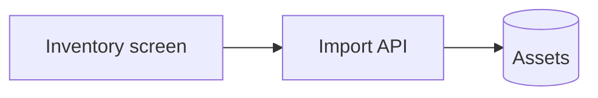

# Team Inventory — Developer Flow Guide
<!-- document: developer-flow-guide -->
<!-- INVENTED fixture from docs/Greenfield-Case-Study.md; not a real project. -->

| | |
|---|---|
| Purpose | Help a developer understand and debug the owner filter and the CSV import |
| Scope | whole feature |
| Subject type | Mixed |
| Audience | Developers |
| Companion docs | Implementation Checklist, DB-Changes, Architecture |
| Updated by | `/refresh-doc` (Mode B) on any code change |
| Last synced to code | 2026-09-26 |

## 1. Map

## 2. Screen / Tab flows

### 2.1 Inventory screen

| UI element | Frontend file:method | API endpoint | Service method | Data access | Table |
|---|---|---|---|---|---|
| Owner filter | `OwnerFilter.tsx:onOwnerChange` | `GET /api/assets?owner=` | [PLANNED] | [PLANNED] | assets |

## 3. Service / package / job flows

### 3.1 CSV import

| # | Step | Code | External call | Writes to | Notes |
|---|---|---|---|---|---|
| 1 | Validate tags | `CsvImportController.ts:validateTags` | — | — | rejects duplicates |
| 2 | Insert rows | `ImportRepository.ts:insertAssets` | — | assets | one transaction |

## 4. Cross-cutting flows

Authorization runs before every import in `CsvImportController.ts:importCsv`.

## 5. Where do I look

| Symptom | Likely layer | Start here |
|---|---|---|
| Import says success but no rows | repository | §3.1 step 2 |
