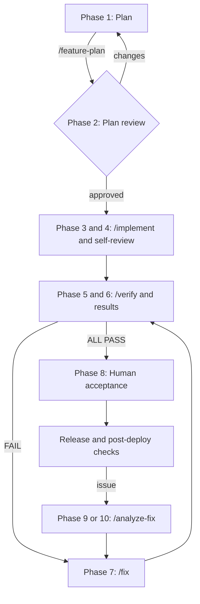

# Getting Started with AIFP

Audience: process owners, engineering/QA/security leads, and developers onboarding the
AI-First Playbook into a new or existing repository.

AI-First Playbook (AIFP) is an OpenCode workflow for spec-driven team delivery. Plan from
explicit inputs, build from one living checklist, verify independently by executing the real
behavior, and feed escaped defects back into that checklist. Markdown is authoritative;
generated HTML is for human readers.

## Lifecycle



The Implementation Checklist is the single build-and-verify contract. Item metadata, the Status
Table, deployment and infrastructure requirements, inline verdicts, and the Verifier Run Log all
live there. A checkbox or chat message is not authoritative status.

## 1. Install for OpenCode

Requires Node.js 22.14.0 or later, npm 11.5.1 or later, OpenCode, and the toolchain required by
your application.

```bash
cd /absolute/path/to/project
npx @techierathore/ai-first-playbook@latest install --dry-run
npx @techierathore/ai-first-playbook@latest install
```

Use `--target="/absolute/path/to/project"` when running elsewhere. Existing files are preserved
unless `--force` is explicit. The installer adds the OpenCode runtime under `.opencode/`,
`opencode.json`, `AGENTS.md`, lifecycle docs, operational templates, and the playbook profile.
It does not install or configure your application toolchain.

For source-checkout installation:

```bash
git clone <repository-url> ai-first-playbook
node ai-first-playbook/scripts/install.mjs install --target="/absolute/path/to/project"
```

See [Installation.md](Installation.md), [Usage.md](Usage.md), and
[Repository-Structure.md](Repository-Structure.md).

### Windows

Run OpenCode, Git, Node, and the project toolchain in WSL. Prefer a Linux-filesystem checkout such
as `~/work/my-project`; see [OpenCode-WSL-Setup-Guide.md](OpenCode-WSL-Setup-Guide.md).

## 2. Complete the environment profile

Replace every placeholder in `playbook/environment-profile.yml`. Confirm the real:

- topology, operating system, and shell;
- build, test, start, stop, and cleanup commands;
- API and web URLs;
- database access method, config path, and migration command;
- browser endpoint and log paths;
- approved secret source types; and
- verification evidence directory.

Do not copy example ports, infer a migration tool, or invent missing values. Resolve unknowns with
the responsible owner. See [Environment-Profile.md](Environment-Profile.md).

## 3. Protect secrets and evidence

Use an approved secret manager, environment reference, protected stdin, or protected temporary
file. Never put credentials, tokens, connection strings, cookies, authorization headers, or
unredacted PII in Markdown, arguments, URLs, logs, process dumps, or stored evidence. Redact before
retention. See [Security.md](Security.md).

## 4. Establish authority

`AGENTS.md` carries always-on rules for logging, error handling, coding standards, UI fidelity,
Verifier write scope, and version control. The approved checklist is authoritative for each
feature. The Verifier writes findings inline and must not create a competing gap report,
verification report, or fix checklist.

## 5. Run a planted-defect smoke test

Before real delivery work:

1. Complete and validate the environment profile.
2. Use a disposable local feature and approved synthetic data.
3. Plant one deterministic defect whose observable result contradicts a small seven-field item.
4. Run `/verify @docs/<Feature>-Implementation-Checklist.md` in OpenCode.
5. Confirm the item receives an inline `FAIL` with executed and observed evidence.
6. Confirm evidence is under `verification/<feature>/<run-id>/`, with no separate report and no
   product-source edit by the Verifier.
7. Run `/fix` and then a fresh `/verify`; PASS is valid only after the runtime check succeeds.

`DATA-GAP` and `BLOCKED` do not prove defect detection. Supply the missing data or infrastructure
and repeat.

## 6. Optional OpenCode telemetry

When metrics are required, start OpenCode with capture enabled before launch:

```bash
PLAYBOOK_TELEMETRY=1 opencode
```

Ignore only transient `/verification/telemetry/events.ndjson`; preserve durable
`verification/telemetry/misses.ndjson`. Export phase and miss records through
`scripts/playbook-telemetry.mjs`, preserve null/incomplete quality, and never split one command
window into estimated conceptual-phase usage. See [Telemetry-Guide.md](Telemetry-Guide.md).

## 7. Optional unattended operation

Add `YOLO` to a Playbook command or set `PLAYBOOK_YOLO=1` before starting OpenCode. The OpenCode
policy permits ordinary work while denying git history/index/ref writes and publishing. The
source-checkout supervisor persists state, waits through provider usage limits, and resumes the
same OpenCode session. See [YOLO-Mode-Guide.md](YOLO-Mode-Guide.md).

## 8. Roles

| Role | Responsibility | Must not do |
|---|---|---|
| Analyst | Ask for missing business, architecture, data, security, and acceptance inputs; create or amend the plan. | Guess missing context or implement product code. |
| Orchestrator | Plan dependency-aware waves, assign exclusive slices, aggregate results, self-review, and persist the implementation handoff. | Leave in-scope items silently unfinished or independently verify its own work. |
| Builder | Implement only the assigned seven-field slice and report files, blockers, and deployment/infrastructure discoveries. | Edit another wave's files or race on the checklist. |
| Verifier | In fresh context, execute real behavior, collect evidence, assign inline verdicts, and update status. | Edit product source/configuration or accept implementation claims as proof. |
| Human approvers | Own plan review, acceptance, release, rollback, and operations transfer. | Treat chat or a checkbox as durable approval. |

## 9. End-to-end flow

1. **Choose the entry point.** Greenfield work begins with requirements, mockups when relevant,
   standards, DB architecture, and naming/output decisions. Brownfield work starts with
   `/legacy-audit` and an evidence-backed behavior baseline.
2. **Plan.** Run `/feature-plan` in fresh context. Review every item's Behavior, Location, UI ref,
   Logging, Acceptance, Verify, Coding Standards, and Type fields.
3. **Approve.** Persist a named, timestamped plan decision with evidence, open decisions,
   escalation owner, and exception expiry.
4. **Implement and self-review.** Run `/implement`. The Orchestrator must finish every item in
   scope or name the genuine external dependency and supplier. Build, test, smoke, inspect side
   effects, and clean up started services.
5. **Verify independently.** Run `/verify` in fresh context. The Verifier executes deployment
   steps and real behavior using profile-defined values.
6. **Fix and repeat.** Run `/fix` only for active FAIL scope, then a fresh `/verify`, until ALL PASS.
7. **Accept and release.** QA/Product reviews runtime evidence and business behavior. Release/Ops
   records migration order, compatibility, rollback, monitoring, post-deploy checks, and ownership.
8. **Handle escaped defects.** Preserve evidence, run `/analyze-fix` against the existing
   checklist, approve the improved Verify method, then `/fix` and fresh `/verify`.

## 10. Core commands

| Command | Use |
|---|---|
| `/feature-plan` | Create the verifiable feature document set from explicit inputs. |
| `/legacy-audit` | Characterize an unknown module before changing it. |
| `/implement` | Build the approved checklist in waves and self-review. |
| `/verify` | Independently execute every Verify method and write inline verdicts. |
| `/fix` | Repair only active FAIL items and return to fresh verification. |
| `/analyze-fix` | Analyze an escaped bug or vague gap and amend the existing checklist. |
| `/amend-checklist` | Make a known surgical checklist edit. |
| `/create-issue-list` | Convert approved tracker/manual input to a transient Issues file. |
| `/add-doc`, `/refresh-doc`, `/upgrade-docs` | Create or reconcile documentation against reality. |
| `/generate-html` | Render human Markdown; skip working checklists and Issues files. |
| `/archive-checklist` | Compact eligible PASS history while preserving restoration. |

## 11. Durable handoffs

At every gate record producer, consumer, accountable approver, identity, UTC timestamp, status
transition, evidence links, open decisions, escalation owner, and exception expiry. Templates under
`templates/handoffs/` cover plan approval, implementation, verification, acceptance, PR evidence,
release readiness, operations transfer, and incidents. See [Handoffs.md](Handoffs.md).

## 12. Adoption checklist

- [ ] A process owner and backup are named.
- [ ] OpenCode is installed and restarted after configuration changes.
- [ ] Every profile placeholder is replaced and each declared command is tested.
- [ ] Secret sources and evidence-redaction rules are approved.
- [ ] `AGENTS.md`, coding standards, and the single-checklist rule are understood.
- [ ] Telemetry retention and quality rules are configured when capture is required.
- [ ] YOLO permissions and rate-limit resume are understood before unattended operation.
- [ ] The planted-defect smoke test produces an inline FAIL and no separate report.
- [ ] Product, engineering, QA, security, release, operations, and escalation owners know their gates.
- [ ] One pilot feature completes plan through post-deploy validation.
- [ ] A second developer completes the loop without the original operator driving it.
- [ ] Handoff packets are durable, linked, acknowledged, and timestamped in UTC.

## Further reading

- [Operating-Model.md](Operating-Model.md)
- [Release-And-Operations.md](Release-And-Operations.md)
- [Adoption-Metrics.md](Adoption-Metrics.md)
- [Telemetry-Guide.md](Telemetry-Guide.md)
- [YOLO-Mode-Guide.md](YOLO-Mode-Guide.md)
- [Greenfield-Case-Study.md](Greenfield-Case-Study.md)
- [Brownfield-Case-Study.md](Brownfield-Case-Study.md)
