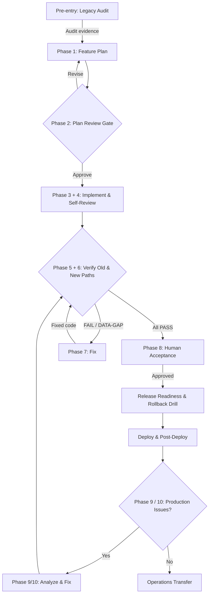

# Brownfield Onboarding and Change Runbook

This reusable runbook brings an incompletely documented legacy module into the AI-First Playbook
(AIFP), establishes an evidence-backed baseline, and then delivers a compatible change. **Legacy
Inventory Owner Filter** is an illustrative example only; it is not a shipped feature, fixture,
migration, architecture prescription, or reference implementation.

## SDLC-to-AIFP Phase Mapping

Every conventional SDLC stage maps to an explicit AIFP phase, command, agent, inputs, outputs,
gate, and telemetry metric. The table below is the authoritative crosswalk.

| SDLC Stage | AIFP Phase | Command | Agent | Inputs | Outputs | Gate | Metrics |
|---|---|---|---|---|---|---|---|
| Discovery/Audit | Pre-entry | `/legacy-audit` | Analyst | Module, profile, checklist | Evidence under `verification/` | Audit complete | `legacy-audit` |
| Requirements | [Phase 1 — Plan](../phases/01-plan.md) | `/feature-plan` | Analyst | Audit evidence, requirements, standards | Checklist, architecture | [Phase 2 — Plan Review](../phases/02-plan-review-gate.md) human gate | `feature-plan` |
| Design | [Phase 1 — Plan](../phases/01-plan.md) (continued) | `/feature-plan` | Analyst | Audit + requirements | Compatible design, safe seams | Plan approval | `feature-plan` |
| Development | [Phase 3 — Build](../phases/03-build.md) + [Phase 4 — Self-Review](../phases/04-self-review.md) | `/implement` | Orchestrator → Builders | Approved checklist | Compatible code, old path preserved | `implementation-summary` | `implement` |
| Testing/Verification | [Phase 5 — Verify](../phases/05-verify.md) + [Phase 6 — Results Gate](../phases/06-verification-results-gate.md) | `/verify` | Fresh Verifier | Checklist, baseline, matrix | Before/after evidence, verdicts | `verification-results` | `verify` |
| Bug Fixing | [Phase 7 — Fix](../phases/07-fix.md) | `/fix` | Orchestrator → Builders | FAIL items | Fixed code | Fresh `/verify` | `fix` |
| Acceptance | [Phase 8 — Human Acceptance](../phases/08-human-acceptance.md) | Human gate | QA/Product | PASS checklist, before/after | `acceptance.md` | Human approval | None |
| Release | Human gate | Release team | Acceptance, rollback drill | `release-readiness.md` | Release approval | None | None |
| Maintenance | [Phase 9](../phases/09-post-verification-bugs.md) / [Phase 10](../phases/10-production-bugs.md) | `/analyze-fix` | Analyst | Issues, incidents | Updated checklist | `analyze-fix` | `miss`/`miss-fix` |

## 1. Objective, Audience, Roles, and Safety

**Objective:** characterize the current system, turn evidence into a verifiable contract, change it
through a reversible seam, independently compare old and new behavior, and transfer enough
knowledge for another owner to release, roll back, operate and support it.

**Audience:** Product/BA, legacy maintainers, Engineering, QA, Security/privacy/data stewards,
Release, Operations, and facilitators onboarding teams to repeat this process.

| Role | Accountability |
|---|---|
| Human sponsor / Product | Defines desired outcome, accepted legacy quirks and accepted differences. |
| Legacy owner / SME | Supplies history and ownership context; recollection never replaces evidence. |
| Analyst agent | Audits the module and creates the evidence-based implementation contract. |
| Orchestrator / builders | Implement approved items and perform embedded self-review. |
| Fresh-context Verifier | Executes old and new paths and records independent inline verdicts. |
| QA / business approver | Performs human acceptance and persists the decision. |
| Security / data steward | Approves classification, access, fixtures, redaction and retention. |
| Release / Operations | Owns rollout, rollback, monitoring, support and incident routing. |

**Safety principle: observe and characterize before product edits.** Discovery may read source, run
profile-declared checks, and add verification-side characterization assets. It must not silently
clean up product code. Preserve baseline evidence even when it proves an awkward behavior or known
defect; an unknown is a risk to investigate, not permission to redesign.

## 2. Prerequisites

1. Install AIFP in the target repository and read root `AGENTS.md`.
2. Replace relevant placeholders in `playbook/environment-profile.yml` with reviewed project facts.
3. Confirm the profile declares the real topology, build/test/start/stop commands, application
   endpoints, database method/config path, browser endpoint, log paths and cleanup command.
4. Never infer a command, port, config file, migration tool, database or secret source from this
   runbook. An incomplete profile is fixed by its owner before runtime probing.
5. Name Product, technical, data, security, release, operations and escalation owners.
6. Obtain least-privilege observation access and establish deployment and rollback authority.
7. Prepare synthetic fixtures or explicitly approved non-sensitive fixtures; record provenance,
   approval, retention and disposal. Do not copy production data merely because the module is old.
8. Confirm evidence can be written below repository-root `verification/` without secrets,
   unredacted PII, raw credentials or restricted business data.
9. Locate the actual coding standards and any existing architecture, data, API, UI, deployment,
   support and incident documents. Missing documents remain named unknowns.
10. Choose a stable `<feature>` token and unique UTC `<run-id>`.

## 3. Discovery Input Pack

| Input | Minimum content |
|---|---|
| Target boundary | Repository/module, entry points, user journey and explicit exclusions. |
| Environment | Reviewed profile with no relevant placeholders. |
| Requirements | Existing BRD, ticket, specification, support request or short outcome statement. |
| Current knowledge | Manuals, screenshots, contracts, schemas, logs, tests and workarounds that exist. |
| Ownership | Product, code, data, security, release, operations and escalation owners. |
| Data controls | Classification, approved environment/fixture, redaction, retention and disposal. |
| Engineering controls | Coding standards, review policy, protected paths and change windows. |
| Release controls | Compatibility window, flag policy, rollback authority and incident route. |
| Known defects | Reproduction and a preserve/fix/defer decision for each known issue. |
| Acceptance intent | Desired outcome, must-not-change behavior and acceptable differences. |

For the illustrative Legacy Inventory Owner Filter, the pack may name an existing inventory screen
and a desired owner filter. It must not assume React, SQL, an API shape, a flag name, ports,
commands or seeded defects; those facts must come from the target repository and profile.

## 4. Put the Discovery Contract Before the Audit

`/legacy-audit` links evidence and must-not-change behavior into an existing checklist. Before it
runs, the Analyst and sponsor create or select a **minimal discovery checklist contract** at a
repository-approved path. This is not the feature implementation plan. It records:

- target, exclusions, owners, profile and coding-standards paths;
- the no-product-edits boundary and approved baseline/fixture controls;
- expected inventory, dependency, ownership, behavior, characterization, classification, risk and
  safe-seam evidence;
- items for every already-known preserved behavior; and
- exact evidence destination `verification/<feature>/legacy-audit-<run-id>/`.

Invoke the installed OpenCode command from the target repository root:

```text
/legacy-audit @playbook/environment-profile.yml @<discovery-checklist-path> <target, feature token, run ID, scope and approved constraints>
```

Do not claim that the command generates named files such as `legacy-audit.md`, `baseline.md` or
`risk-register.md`; no such filename contract exists. Its guaranteed handoff is produced evidence
under `verification/<feature>/legacy-audit-<run-id>/` plus links/preservation items in the supplied
checklist. If an installed variant does not require a checklist, pass its evidence directory
directly into `/feature-plan`; never invent an audit summary file as an intermediary.

## 5. Enable Telemetry Before Command Execution

Start OpenCode with capture enabled **before any instrumented slash command**:

```bash
PLAYBOOK_TELEMETRY=1 opencode
```

Events append best-effort to `verification/telemetry/events.ndjson`. Setting the variable after
OpenCode starts does not retroactively register the plugin; restart it. Telemetry failure never
blocks delivery, and events contain no prompts, source, raw arguments, secrets or PII.

OpenCode exports normalized schema-2, message-granularity command metrics including model mix,
tokens, time and recursively linked subagents.

## 6. Product Baseline Before Code Changes

The Legacy owner and Analyst capture these facts with synthetic or approved fixtures:

1. **Source identity:** a human records the revision and, if policy permits, an existing release
   tag. Agents do not create tags, stage, commit or rewrite history.
2. **Clean build/tests:** run only profile-declared commands; record command, UTC time, environment,
   result and evidence link. Explain pre-existing failure rather than hiding it.
3. **UI:** route, roles, visible states, loading/empty/error behavior, accessibility observations
   and approved redacted screenshots, where a UI exists.
4. **API:** observed request/response/status compatibility, authorization and error behavior.
5. **Database/data:** reads, writes, constraints, ordering, null/empty handling and side effects
   through the profile-declared method; credentials never enter evidence.
6. **Logs:** event names, levels, correlation, start/finish/failure signals and redaction; retain
   only approved sanitized excerpts.
7. **Characterization tests:** narrow tests or runners that encode observed behavior without
   correcting it; label quirks and defects explicitly.
8. **Dependencies/ownership:** upstreams, downstreams, consumers, packages, jobs, stores,
   deployment units, owners and escalation paths.
9. **Data classification:** field classes, access, fixture approval, evidence restrictions,
   retention and deletion owner.
10. **Risks/unknowns:** impact, likelihood, detection, decision owner and expiry.
11. **Safe seams:** real extension points, optional parameters, adapters, flags or additive choices
    that keep a reversible old path.
12. **Known defects:** reproduction evidence and preserve/fix/defer decision; never silently turn a
    defect into a requirement or silently repair it during discovery.

### Keep Two Baselines Separate

- **Product baseline:** current build/test and UI/API/database/log behavior, existing performance
  measures, operational signals and defect reproductions. Compare it to old/new and post-deploy.
- **AIFP process baseline:** command records for `legacy-audit`, `feature-plan`, `implement`,
  `verify` and actual `fix` runs: elapsed, active operation time, models, tokens, measured cost,
  attempts, subagents and miss lifecycle.
- Agent elapsed time is not product latency or human effort; product measures are not planning
  quality. The first feature establishes a process baseline, not proof of improvement.

## 7. Brownfield Lifecycle Flow

The diagram below shows the baseline → audit → plan → implement → verify loop, including the
fix/reverify cycle and human gates.



## 8. End-to-End SDLC Runbook

Each step supplies role/agent, inputs, command, artifact/evidence, exit/gate and expected
telemetry. Miss events are exceptions, not quotas; none is normal when the contract and execution
are sound.

### Step 0 — Validate Inputs and Capture (SDLC: Environment Setup)

- **Phase:** Pre-entry (telemetry setup)
- **Role / agent:** Human operator; Security/data owner where required.
- **Inputs:** Installed harness, reviewed profile, discovery pack and fixture approval.
- **Command:** `PLAYBOOK_TELEMETRY=1 opencode`; do not run an application command yet.
- **Artifact / evidence:** Input links, profile review, owners and fixture approval.
- **Exit / gate:** Relevant profile facts are real and contain no forbidden secret values.
- **Metric / misses:** No slash-command metric for launcher setup; no miss expected.

### Step 1 — Record Revision and Clean Baseline (SDLC: Environment Setup)

- **Phase:** Pre-entry baseline capture
- **Role / agent:** Human records revision; Analyst observes; Legacy owner explains anomalies.
- **Inputs:** Source identity, profile commands, fixture, known defects and evidence location.
- **Command:** Profile build/test and only approved runtime/browser/data/log/cleanup commands.
- **Artifact / evidence:** Results, characterized UI/API/data/log behavior, tests, maps, risks and seams.
- **Exit / gate:** Baseline is reproducible, or each gap has an owner and blocks affected planning.
- **Metric / misses:** Profile commands do not automatically create slash-command metrics; emit a
  specification miss only for a genuine omitted requirement/control, not routine inquiry.

### Step 2 — Legacy Audit (SDLC: Discovery/Audit)

- **Phase:** Pre-entry — `/legacy-audit` ([Pre-entry](../phases/01-plan.md))
- **Role / agent:** Analyst; Legacy, Security and data owners answer factual questions.
- **Inputs:** Profile, discovery checklist, target, baseline and fixture controls.
- **Command:**
  ```text
  /legacy-audit @playbook/environment-profile.yml @<discovery-checklist-path> <scope>
  ```
- **Artifact / evidence:** `verification/<feature>/legacy-audit-<run-id>/` evidence and linked
  must-not-change items in the supplied checklist.
- **Exit / gate:** No product edit; inventory/maps/behavior/tests/classification/risks/seams are
  evidenced; unresolved data gaps have owners.
- **Metric / misses:** One `legacy-audit` command window when instrumented; genuine plan/checklist
  omissions may create classified misses, never routine discovery churn.

### Step 3 — Evidence-Based Feature Plan (SDLC: Requirements + Design)

- **Phase:** [Phase 1 — Plan](../phases/01-plan.md) — `/feature-plan`
- **Role / agent:** Analyst with Product, Engineering, QA, Security and Operations.
- **Inputs:** Requirements, standards, architecture/data references, audit evidence, preserved
  behavior, known defects, risks and desired change.
- **Command:**
  ```text
  /feature-plan @<requirements> @<standards> @<reference-docs> \
    @verification/<feature>/legacy-audit-<run-id>/ \
    <output folder and compatibility constraints>
  ```
- **Artifact / evidence:** Project-convention docs and full checklist; every desired/preserved
  behavior has Behavior/Location/UI ref/Logging/Acceptance/Verify/Coding Standards plus `Type`,
  dependencies, old path, selection mechanism, rollback and evidence links.
- **Exit / gate:** No unknown masquerades as fact; defects say preserve/fix/defer; both paths are
  executable; Infrastructure Requirements and Deployment Steps sections exist.
- **Metric / misses:** One `feature-plan` command window per invocation; review-discovered omissions
  become plan/checklist misses when they meet the schema criteria.

### Step 4 — Plan Review Gate (SDLC: Design Review)

- **Phase:** [Phase 2 — Plan Review Gate](../phases/02-plan-review-gate.md) — human gate
- **Role / agent:** Human Product, Engineering, QA, Security and Operations approvers.
- **Inputs:** Planned docs, audit links, matrix, risks, verification and rollback plan.
- **Command:** No gate command; revise with `/feature-plan` as needed and use
  `templates/handoffs/plan-approval.md` or an equivalent durable record.
- **Artifact / evidence:** Producer, consumer, accountable approver, identity, UTC timestamp, status
  transition, evidence, open decisions, escalation owner and exception expiry.
- **Exit / gate:** Coverage, verification, compatibility, rollback and ownership are approved; no
  blocking data gap remains.
- **Metric / misses:** Human gate has no metric; each revision command has a new `feature-plan`
  window. Genuine escaped planning gaps create miss lifecycle records.

### Step 5 — Compatible Implementation (SDLC: Development)

- **Phase:** [Phase 3 — Build](../phases/03-build.md) + [Phase 4 — Self-Review](../phases/04-self-review.md) — `/implement`
- **Role / agent:** Orchestrator and builders under Engineering ownership.
- **Inputs:** Approved checklist, standards, sibling docs and profile.
- **Command:**
  ```text
  /implement @<implementation-checklist> @<coding-standards>
  ```
- **Artifact / evidence:** Checklist-scoped code; preserved old path; approved flag/selection/default;
  target-specific deploy/rollback scripts only if needed; updated checklist deployment/infra.
- **Exit / gate:** Every item is built, self-tested and `to-verify`, or names its external blocker
  and supplier. Old path, rollback and logging match the plan.
- **Metric / misses:** One `implement` window per invocation, covering build **and embedded
  self-review**; do not conceptually split tokens/time. The Orchestrator centralizes builder miss
  candidates; parallel builders do not allocate miss IDs.

### Step 6 — Embedded Self-Review (SDLC: Development, continued)

- **Phase:** [Phase 4 — Self-Review](../phases/04-self-review.md) (part of `/implement`)
- **Role / agent:** Same Orchestrator; this is part of `/implement`, not another command.
- **Inputs:** Built code, Verify fields, profile and Developer Flow Guide if present.
- **Command:** Profile build/test/start/stop plus focused smoke, data-side-effect and log probes.
- **Artifact / evidence:** Per-item self-test notes, runtime/data/log proof, updated deployment/infra
  and cleanup confirmation.
- **Exit / gate:** Build and smoke pass; success status without required side effect is failure.
  Self-review never grants independent PASS.
- **Metric / misses:** No second phase record; evidence stays in `implement`. A genuine self-review
  miss may be deferred after repair, but only independent verification closes it as pass.

### Step 7 — Fresh Verification of Old and New Paths (SDLC: Testing/Verification)

- **Phase:** [Phase 5 — Verify](../phases/05-verify.md) + [Phase 6 — Verification Results Gate](../phases/06-verification-results-gate.md) — `/verify`
- **Role / agent:** Fresh-context Verifier that did not implement the change.
- **Inputs:** Checklist, verification guide, baseline, matrix, profile, deploy steps and fixture.
- **Command:**
  ```text
  /verify @<implementation-checklist> @<verification-guide>
  ```
- **Artifact / evidence:** `verification/<feature>/<verify-run-id>/` runtime evidence; inline
  `**Verifier Result**`, Status Table and Verifier Run Log in the checklist. No separate Gap Report.
- **Exit / gate:** Every item is PASS (or explicitly limited `PASS (code-audit)`); FAIL, DATA-GAP or
  BLOCKED prevents acceptance/release.
- **Metric / misses:** One `verify` window covering verification **and results gate**; do not split
  it. Parent Verifier serially opens/links failures; parallel workers never write the miss stream.

### Step 8 — Fix and Reverify (SDLC: Bug Fixing)

- **Phase:** [Phase 7 — Fix](../phases/07-fix.md) — `/fix` then `/verify`
- **Role / agent:** Orchestrator/builders fix; fresh Verifier proves.
- **Inputs:** Inline findings, linked miss IDs, baseline and approved plan.
- **Command:**
  ```text
  /fix @<implementation-checklist>
  /verify @<implementation-checklist>
  ```
- **Artifact / evidence:** Inline root-cause/fix/self-test notes, revised rollback if needed, new
  verification evidence and lifecycle outcomes after independent PASS.
- **Exit / gate:** Every failure is addressed or externally blocked; reverify is all PASS.
- **Metric / misses:** One `fix` window per invocation and one `verify` per rerun. Keep attempts
  distinct; fix may defer linked misses, while only the Verifier closes pass. Never infer a run ID.

### Step 9 — Human Acceptance (SDLC: Acceptance)

- **Phase:** [Phase 8 — Human Acceptance](../phases/08-human-acceptance.md) — human gate
- **Role / agent:** QA and Product/BA; policy owners join when relevant.
- **Inputs:** All-PASS checklist, before/after evidence, guide and accepted differences.
- **Command:** Human scenarios; persist with `templates/handoffs/acceptance.md`.
- **Artifact / evidence:** Identity, UTC timestamp, scope, evidence, exceptions and expiry.
- **Exit / gate:** Business behavior is accepted and no data gap remains.
- **Metric / misses:** No command metric; acceptance defects are escaped misses and return through
  analysis/fix/verify, not edits to historical baseline.

### Step 10 — Release Readiness and Rollback Drill (SDLC: Release)

- **Phase:** Release gate — human gate
- **Role / agent:** Release/Operations with Engineering and Security.
- **Inputs:** Acceptance, deployment/infra, matrix, rollback, monitoring, window and contacts.
- **Command:** Only target-approved commands; record with
  `templates/handoffs/release-readiness.md`.
- **Artifact / evidence:** Signed packet and timed non-production rollback drill with source/data,
  old-path and monitoring proof.
- **Exit / gate:** Forward/reverse order works, old path survives the compatibility window,
  thresholds/owners exist, and failed drill blocks release.
- **Metric / misses:** No slash metric; failed readiness routes to plan/fix/verify and may create a
  classified miss. A chat waiver is not approval.

### Step 11 — Deploy and Post-Deploy (SDLC: Release, continued)

- **Phase:** Release — authorized operator
- **Role / agent:** Authorized Release/Operations operator; Engineering observes.
- **Inputs:** Approved packet, exact target steps, protected secrets and rollback authority.
- **Command:** Only commands recorded from the real profile/checklist; this runbook supplies no app
  command, port, migration tool or secret value.
- **Artifact / evidence:** Version/state, sanitized health/business/data/log checks and decision.
- **Exit / gate:** Old/default and enabled paths meet the matrix; failure pauses rollout or invokes
  rollback.
- **Metric / misses:** Deployment has no AIFP metric unless an instrumented command owns it;
  production defects route to incident and production-bug analysis.

### Step 12 — Operations Transfer and Incident Route (SDLC: Maintenance)

- **Phase:** [Phase 9](../phases/09-post-verification-bugs.md) / [Phase 10](../phases/10-production-bugs.md) — `/analyze-fix`
- **Role / agent:** Engineering producer to Operations consumer; service owner approves.
- **Inputs:** Final checklist, baseline, release, monitoring, rollback and contacts.
- **Command:** Use `templates/handoffs/operations-transfer.md`; for an event use
  `templates/handoffs/incident.md` and the approved production-bug flow.
- **Artifact / evidence:** Transfer/incident packet linking owner, severity, evidence, mitigation,
  rollback state and next action.
- **Exit / gate:** A replacement operator can detect, triage, disable/roll back and escalate without
  the original developer; incident learning feeds characterization and the next checklist.
- **Metric / misses:** No transfer metric; production escapes and later analysis/fix/verify retain
  separate command windows and miss lifecycle rather than rewriting history.

## 9. Compatibility Verification Matrix

Populate expected outcomes from observed baseline and approved requirements, using the same
approved fixture where possible; this table does not prescribe product behavior.

| Scenario | Old/default proof | New/enabled proof | Gate |
|---|---|---|---|
| Selection absent/default or off | Baseline contract remains executable. | New path is not accidentally selected. | No unexplained UI/API/data/log difference. |
| Selection on | Old path remains recoverable. | Approved behavior works end to end. | Every mapped item passes. |
| Authorized/unauthorized roles | Existing allow/deny remains. | New path applies approved authorization. | No privilege expansion or disclosure. |
| Empty/null/invalid input | Baseline response is recorded. | Approved safe state/error and logs occur. | No crash, ambiguity or silent partial success. |
| Ordering/paging/search | Existing semantics are recorded. | Compatible semantics use deterministic fixtures. | Accepted differences only. |
| Dependency failure | Existing failure behavior is known. | New path fails safely. | Response, side effect and sanitized logs agree. |
| Known legacy defect | Preserve/fix/defer decision is reproduced. | Defect is not masked or spread accidentally. | Explicit decision is honored. |
| API/schema consumers | Existing consumer continues. | Additive/approved contract works. | No unapproved break. |
| Rollback | Old path and data recover. | New path disables/reverses. | Timed drill and post-rollback baseline pass. |

## 10. Rollback Drill

1. Record revision, deployed state, selection/flag state and approved fixture state.
2. Apply the candidate through exact readiness steps in a permitted environment.
3. Prove both paths and the monitoring/log signals that detect failure.
4. Invoke the named rollback authority and documented reverse order.
5. Compare version, old-path UI/API, data and logs with baseline.
6. Confirm repeated rollback is idempotent only where the target design promises it.
7. Record elapsed recovery without inventing a target; compare to the approved recovery objective.
8. Block release for incomplete data reversal, unavailable old path, exposed secrets or unowned work.

## 11. Failure Routes

| Finding | Route |
|---|---|
| Profile lacks a runtime fact | Profile owner supplies it; do not guess. |
| Baseline build/test fails | Record known defect; Product/Engineering choose preserve, repair-first or block. |
| Data classification is unknown | Data steward owns DATA-GAP; affected work stops. |
| Unknown consumer/owner appears | Update audit/plan inputs and gate the risk before implementation. |
| Plan omits baseline or rollback | Return to `/feature-plan`; record qualifying plan/checklist miss. |
| Implement smoke fails | Keep item not-to-verify, repair and rerun smoke. |
| Verify FAIL | `/fix` inline finding, then fresh `/verify`. |
| Verify DATA-GAP/BLOCKED | Named human/infra owner supplies dependency; no acceptance. |
| Acceptance defect | Record escape, analyze, amend contract if needed, fix and reverify. |
| Readiness/rollback drill fails | Block release and return to plan/fix/verify. |
| Post-deploy check fails | Pause/rollback, open incident and production-bug route. |
| Telemetry is absent/incomplete | Report missing/unsupported/incomplete, never zero. |

## 12. Metrics Export, Quality, and TfLens Handoff

Export from the target repository root after windows close:

```bash
node scripts/playbook-telemetry.mjs \
  --checklist=<path-to-implementation-checklist>

node scripts/playbook-telemetry.mjs --misses
```

Both emit NDJSON to stdout. Controlled checkpoint examples are:

```bash
node scripts/playbook-telemetry.mjs --checklist=<path-to-implementation-checklist> \
  > <approved-checkpoint>/phase-metrics.ndjson
node scripts/playbook-telemetry.mjs --misses \
  > <approved-checkpoint>/miss-lifecycle.ndjson
```

Follow [`Phase-Efficiency-TfLens-Contract.md`](Phase-Efficiency-TfLens-Contract.md): ingest stdout;
upsert phase rows by repository identity plus `phase_execution_id`; upsert miss lines by immutable
identity while preserving order; retain schema, harness, importer, repository and import time; and
checkpoint completed windows before rotating events. Re-imports must be idempotent.

Quality filters:

- Duration needs `complete:true`; EOF/incomplete duration is null, not zero.
- Active comparisons need `complete:true` and `coverage:"complete"`; partial is a lower bound, unavailable is not zero,
  and active operation time is not human effort.
- Token totals need a complete window, valid data and complete token status; measured cost also needs complete cost.
- Keep measured and estimated dollars separate; use `models[]` for mixed-model attribution.
- Parent totals already include linked child usage; never add subagent usage twice.
- Compare **command phases**: `implement` combines build/self-review and `verify` combines
  verify/results-gate. Never manufacture conceptual token/time splits.
- Model/tier miss rates require linked origin; sole repair windows are the headline set, shared
  values stay apportioned, and absent attribution remains excluded.
- Fold valid amendments, surface diagnostics, show `n of N assessed`, never report by actor, and
  label comparative cohorts below three records `insufficient data`.

## 13. Before/After Strategy Without Fake Numbers

Leave values blank until observed and always retain scope, harness/model and quality exclusions.

| Dimension | Before | After / Comparison Rule |
|---|---|---|
| Build/test | Clean baseline and existing suite. | Same commands plus approved tests; explain scope/count changes. |
| Product behavior | Old UI/API/data/log evidence. | Compare old/default and new/enabled with like fixtures/environments. |
| Product metrics | Existing approved latency/throughput/reliability measures, if any. | Same method; invent no target or result. |
| Known defects | Reproduction and preserve/fix/defer. | Reproduce both paths and report decision compliance. |
| Legacy audit | First `legacy-audit` model/token/time/subagent/miss record. | Compare only later audits of defensibly similar scope. |
| Planning | `feature-plan` executions and plan/checklist misses. | Compare attempts and escaped omissions across similar cohorts. |
| Implementation | Whole `implement` execution. | Combined build/self-review only; model/token/time/subagents/misses. |
| Verification | Initial/rerun `verify` executions. | Attempts, verdict snapshots, misses and quality-complete usage. |
| Fix/rework | No record if no fix occurred. | Each actual `fix`; null cost/provenance is not zero. |

## 14. Artifact Tree and Retention

Feature docs use project conventions. Evidence remains at repository-root `verification/`, not
nested under the feature-doc folder.

```text
features/<feature>/
  <project-convention>-FullStack-Implementation-Checklist.md
  <other actual feature-plan documents>.md
  handoffs/
    {plan-approval,implementation-summary,verification-results}.md
    {acceptance,release-readiness,operations-transfer}.md
    incident.md                         # only if an incident exists
verification/<feature>/
  legacy-audit-<run-id>/               # actual audit evidence
  <verify-run-id>/                     # runtime verification evidence
verification/telemetry/
  events.ndjson                        # transient; rotate after checkpoint
  misses.ndjson                        # durable append-only history
deploy/<feature>/
  <actual target-specific scripts only when required>
```

Do not create empty illustrative scripts or claim named audit files. Retain docs, handoffs and
evidence per repository/data policy. Ignore only transient
`/verification/telemetry/events.ndjson` when configured; preserve and commit durable
`verification/telemetry/misses.ndjson` under closed-vocabulary privacy rules. Rotate events only
after checkpointing every `phase_execution_id`; apply the stricter rule when policies differ.

## 15. Repeat Onboarding Safely

For every later legacy feature, use a new token, run ID, discovery contract and evidence directory.
Reuse the process, not previous architecture assumptions, fixtures, commands, risks or acceptance.
Recheck the profile, owners, classification and source baseline; review prior miss patterns for
process improvements; run a new audit and plan gate; compare only defensible cohorts; and add new
support knowledge to durable operations documentation.

## 16. Final Acceptance Criteria

- [ ] A human recorded source revision; no agent created a tag/commit; profile-driven build/test and
      relevant UI/API/database/log baselines use approved fixtures and have evidence.
- [ ] Audit evidence exists at `verification/<feature>/legacy-audit-<run-id>/`; dependencies,
      ownership, classification, risks, safe seams and known defects are recorded.
- [ ] Every preserved behavior maps to the checklist; old/default and new/enabled paths pass the
      matrix; accepted differences, selection control and rollback are documented.
- [ ] Embedded self-review and fresh verification passed; every item is PASS, fixes were reverified,
      miss outcomes are durable, and no FAIL, DATA-GAP or BLOCKED remains.
- [ ] Acceptance, readiness, rollback drill, post-deploy monitoring, operations transfer and
      incident route are approved and usable by a successor.
- [ ] Metrics are quality-filtered/checkpointed or marked missing/unsupported, never zero; retention
      and evidence disposal follow data and repository policy.

## 17. Debrief

Ask what observation contradicted documentation; which characterization reduced risk; what proves
the old path survived; where accepted differences and rollback authority are durable; whether a new
operator can identify the next action; which misses should improve the next discovery contract;
which metric comparisons were excluded for quality, harness, cohort size, provenance or combined
commands; and what must be retained, checkpointed or disposed of.
