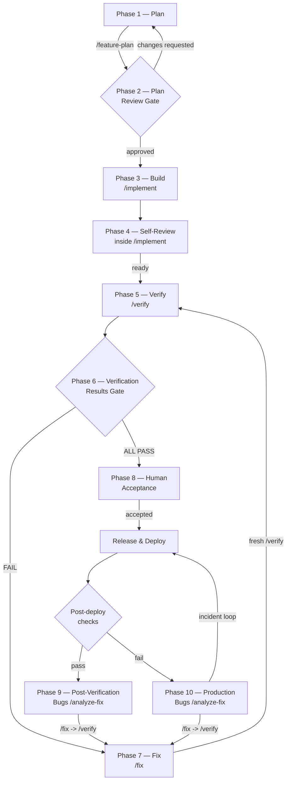
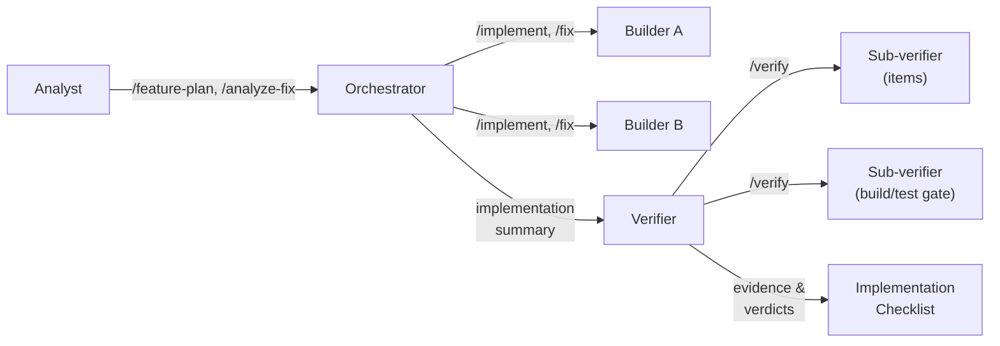
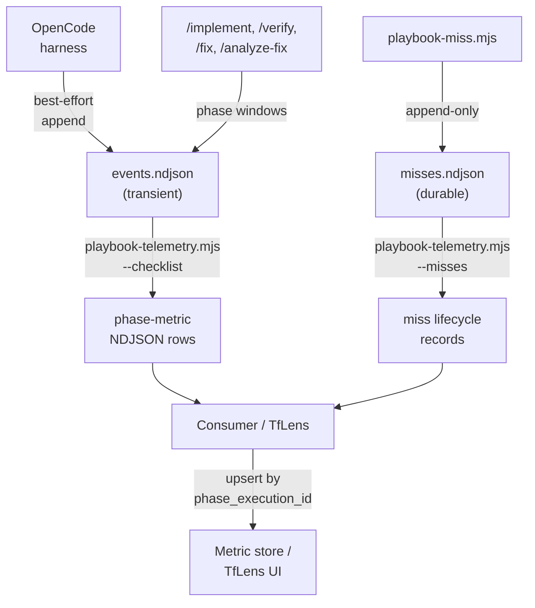

# Getting Started with AIFP

Audience: process owners, engineering/QA/security leads, and developers onboarding the
AI-First Playbook into a new or existing repository.

## What AIFP is

AI-First Playbook (AIFP) is a spec-driven team workflow: plan against explicit inputs, build
from one living checklist, verify independently by executing the real behavior, and feed every
escape back into that checklist. Markdown is authoritative. Generated HTML is a convenience for
human readers, never the source of truth.

## Lifecycle overview

The ten conceptual phases run inside slash commands and human gates. The diagram below shows the
primary forward path, rework loops, and feedback channels.



After onboarding, you should be able to:

1. Choose the correct installation path without assuming that every source-repository script is
   installed into the target project.
2. Complete `playbook/environment-profile.yml` without inventing topology, ports, commands, data,
   or secrets.
3. Explain the ten conceptual AIFP phases and how they differ from command-phase telemetry.
4. Run a planted-defect smoke test and recognise correct inline Verifier behaviour.
5. Take greenfield or brownfield work through approval, build, independent verification,
   acceptance, release, post-deploy validation, and incident feedback.
6. Retain and export trustworthy phase and miss telemetry.

## Terms to align before starting

| Term | Meaning |
|---|---|
| Conceptual phase | One of the ten lifecycle steps documented under `phases/`, such as Phase 3 Build or Phase 6 Verification Results. |
| Command phase | The slash command observed by the harness, such as `implement` or `verify`. This is the `phase` value in phase telemetry. |
| Gate | A decision boundary with an accountable human owner and durable evidence. A checkbox alone is not authoritative status. |
| Implementation Checklist | The single living build-and-verify contract for a feature. It carries item metadata, Status Table, deployment and infrastructure requirements, inline verdicts, and the Verifier Run Log. |
| Evidence | A durable artifact showing what was executed and observed: test output, API response, database assertion, screenshot, log capture, or a signed gate packet. |
| Miss | A classified defect, data gap, or required rework record in the append-only miss lifecycle stream. |
| Attempt snapshot | The checklist run count read when telemetry is exported. It is not a guaranteed historical value captured at phase execution time. |
| Gate-verdict snapshot | The checklist's worst parsed verifier result when telemetry is exported. It is not a guaranteed historical verdict for that command execution. |

The conceptual and measured views deliberately differ. A single `/implement` window includes
Phase 3 Build and Phase 4 Self-review. A single `/verify` window includes Phase 5 Verify and the
Phase 6 Verification Results gate output. Do not split command tokens or cost between conceptual
phases by estimation.

## 1. Installation

Requirements for the installer and shipped Node utilities are Node.js 22.14.0 or later and npm
11.5.1 or later. You also need OpenCode and the toolchain required by your own application. AIFP
does not install, start, or guess that application toolchain.

### Paths

| Path | When to choose | Command | What reaches the target | Boundary |
|---|---|---|---|---|
| OpenCode from npm | Simplest supported install. | `npx @techierathore/ai-first-playbook@latest --target="/absolute/path/to/project"` | `.opencode/`, `opencode.json`, `AGENTS.md`, `Context-Prompt.md`, docs/onboarding, `playbook/{environment-profile,model-tiers}.yml`, and only the target telemetry runtime scripts `scripts/{playbook-miss,miss-lib,playbook-telemetry}.mjs`. | The target does **not** receive every operational script from the AIFP source repository. Do not assume it contains the routing operator, YOLO supervisor, validators, tests, or WSL provisioner. |
| OpenCode from a source clone | Developing AIFP, needing source-only operational utilities, or inspecting before install. | `git clone <repository-url> ai-first-playbook` then `node ai-first-playbook/scripts/install.mjs --target="/absolute/path/to/project"` | The same OpenCode payload described above. The source clone retains the full `scripts/` toolset and canonical `harness/`, `templates/`, and `phases/`. | Run clone-only operational utilities from the source checkout. `scripts/install.mjs` still does not copy all of them into the target. |

Preview before writing:

```bash
npx @techierathore/ai-first-playbook@latest \
  --target="/home/me/work/my-project" --dry-run
```

Existing files are preserved unless `--force` is explicit. Review a dry run and the target diff
before using `--force`. See [Installation.md](Installation.md) and [Usage.md](Usage.md) for
upgrade and uninstall behaviour.

### Windows: use WSL as the primary path

Run OpenCode, Node, Git, and the project toolchain inside WSL. Keep working repositories under
the Linux filesystem, for example `~/work/my-project`, rather than `/mnt/c/...`; this avoids
permission metadata problems and substantially improves file I/O. Complete proxy/certificate,
WSL 2, and corporate setup using
[OpenCode-WSL-Setup-Guide.md](OpenCode-WSL-Setup-Guide.md). Do not copy example ports or hostnames
from a guide into the profile unless they are true for your project.

## 2. Prerequisites

Before the first AIFP command, confirm:

- The application can be built, tested, started, stopped, and cleaned up by known commands.
- Required database, browser, API, log, and migration tools are available for the actual
  topology.
- Development-scoped accounts and seed data exist where runtime verification needs them.
- A coding-standards document is available and can be named in every checklist.
- The requirements source and, for UI work, the mockup are available.
- Git ignores only transient telemetry as described below.
- The process owner, gate approvers, escalation owners, and release/rollback authority are named.

Playwright is optional, but if UI behaviour must be proven, configure the real browser endpoint in
the profile and test its reachability. Do not invent an endpoint or silently substitute a code
audit for executable UI evidence.

## 3. Complete the environment profile

Replace every placeholder before running a command. The profile is authoritative for:

- `project_type`, topology, operating system, and shell.
- Build, test, start, stop, and cleanup commands.
- Actual API and web URLs.
- Database access method, config path, and migration command.
- Optional browser endpoint.
- Log paths.
- Approved secret source types.
- The evidence directory convention.

Use a short stable `project_type` label because it appears in telemetry. Validate every command
manually in the target repository. If a required value is unknown, resolve it with the service
owner; do not copy a placeholder, choose a plausible port, or infer a migration tool. More detail:
[Environment-Profile.md](Environment-Profile.md).

## 4. Protect secrets and evidence

Use an approved secret manager, an environment reference, protected stdin, or a protected
temporary file. Never place a credential, token, connection string, cookie, authorization header,
or unredacted PII in:

- Markdown or checklist text.
- Command arguments or URLs.
- Logs or process-environment dumps.
- Stored verification evidence.

The profile names secret **sources**, not secret values. Redact evidence before retaining it. See
[Security.md](Security.md).

## 5. Establish AGENTS.md authority

`AGENTS.md` is the always-loaded source for standing, cross-cutting rules: logging, UI fidelity,
error handling, coding standards, verifier write scope, version-control behaviour, and the
single-checklist rule. Tailor it deliberately, but do not move critical rules into a long feature
document where context pressure can hide them.

For each feature, the approved Implementation Checklist is authoritative over chat and ad hoc task
lists. `/analyze-fix`, `/amend-checklist`, and `/fix` update that file in place. The Verifier writes
its results inline; it must not create `Gap-Report.md`, `Verification-Report.md`, or a competing
fix checklist. Item metadata and the Status Table, not an isolated checkbox, carry status.

## 6. Configure telemetry retention

Add exactly this repository-root ignore rule:

```gitignore
/verification/telemetry/events.ndjson
```

`events.ndjson` is transient harness capture and may be rotated only after consumers checkpoint
every `phase_execution_id`. Commit and never rotate
`verification/telemetry/misses.ndjson`; it is the durable, append-only quality history. Do not
ignore `verification/telemetry/` or `*.ndjson`, because either rule discards the miss stream.

## 7. Run the first smoke test

Do this before trusting AIFP on real delivery work.

1. Choose a disposable local feature or fixture that can execute under the completed profile.
2. Plant one deterministic defect, such as a test endpoint returning the wrong known value or an
   import reporting success while writing zero expected rows. Do not use production data.
3. Create or select a small seven-field checklist item whose Acceptance and Verify method require
   the correct observable behaviour. Include a concrete runtime assertion, not "inspect the code."
4. Start the harness in the target repository. For OpenCode metrics, start it as shown in the
   telemetry section below.
5. Run:

   ```text
   /verify @docs/<Feature>-Implementation-Checklist.md
   ```

6. Allow the Verifier to run the profile-defined deployment/start/probe steps. It should execute
   the real path and observe the defect.
7. Confirm all expected outcomes:
   - The item receives inline `**Verifier Result**: FAIL` with executed and observed evidence.
   - The Status Table and `## Verifier Run Log` are updated.
   - Verification evidence is stored under `verification/<feature>/<run-id>/`.
   - No separate gap or verification report is created.
   - Product code is not modified by the Verifier.
   - If telemetry is enabled, a miss is appended through the approved CLI and linked in item
     metadata without changing the FAIL verdict.
8. Run `/fix` against the same checklist, then run a **fresh** `/verify`. The repaired item should
   reach PASS only after the independent runtime check succeeds.

A `DATA-GAP` means required seed/fixture data was absent; `BLOCKED` means verification could not
proceed. Neither proves that the planted defect was detected. Fix the setup and repeat. If a
separate report appears, the guardrail is not loading. Troubleshoot before onboarding a team.

## 8. Agent topology

| Agent | Mode and entry points | Responsibility | Must not do |
|---|---|---|---|
| Analyst | Primary persona for `/feature-plan`, `/legacy-audit`, `/analyze-fix`, `/create-issue-list`, `/add-doc`, `/refresh-doc`, and `/upgrade-docs`. | Ask for missing business, architecture, data, security, and acceptance context; produce or amend documents and checklists. | Guess missing context or implement product code. |
| Orchestrator | Primary persona for `/implement` and `/fix`. | Build dependency-aware waves, assign exclusive file/item slices, aggregate results, self-review, smoke test, and persist the implementation handoff. | Quietly leave checklist items for another run or perform independent verification. |
| Builder subagents | Subagents spawned by the Orchestrator, normally in parallel. | Implement only their supplied seven-field slice and report files, blockers, deployment/infrastructure discoveries, and telemetry candidates. | Edit another wave's files, edit the checklist concurrently, allocate miss IDs, or write the miss stream. |
| Verifier | A fresh native subagent targeted by `/verify`; it has no build context. | Execute deployment steps and real behaviour, collect evidence, assign inline verdicts, update status/run log, and serialize miss lifecycle writes. | Edit product source/config/lockfiles or accept implementation claims as proof. |
| Sub-verifiers | Fresh workers spawned by the Verifier by item type plus a build/test gate worker. | Return evidence and telemetry candidates to the parent Verifier without writing shared files. | Allocate miss IDs or race on checklist/stream writes. |



There is no separate command for four conceptual phases:

- **Phase 2 — Plan Review** is a human gate after `/feature-plan`.
  [Phase 2 — Plan Review Gate](../phases/02-plan-review-gate.md).
- **Phase 4 — Self-review** runs inside `/implement` and again inside `/fix`.
  [Phase 4 — Self-Review](../phases/04-self-review.md).
- **Phase 6 — Verification Results** is the inline output and routing decision of `/verify`.
  [Phase 6 — Verification Results Gate](../phases/06-verification-results-gate.md).
- **Phase 8 — Human Acceptance** is performed by QA/BA/product using the evidence and human
  guides. [Phase 8 — Human Acceptance](../phases/08-human-acceptance.md).

## 9. SDLC mapping

The Metrics column names records generated when telemetry is enabled. A command-phase row is not
a second conceptual phase, and human gates do not manufacture token allocations.

| Conventional SDLC activity | AIFP phase | Command(s) | Agent(s) | Gate owner | Primary outputs | Metrics generated |
|---|---|---|---|---|---|---|
| Discovery and analysis | [Phase 1 — Plan](../phases/01-plan.md); [Phase 9 — Post-Verification Bugs](../phases/09-post-verification-bugs.md) / [Phase 10 — Production Bugs](../phases/10-production-bugs.md) for escaped defects | `/legacy-audit`, `/feature-plan`, `/analyze-fix`, optionally `/create-issue-list` | Analyst | Product/BA and engineering owners; incident commander for production triage | Inventory, baselines, risk/unknowns, requirements clarification, root cause, verification-gap patch | Command-phase rows named `legacy-audit`, `feature-plan`, `analyze-fix`, or `create-issue-list`; miss records for classified gaps/escapes |
| Requirements | [Phase 1 — Plan](../phases/01-plan.md) -> [Phase 2 — Plan Review Gate](../phases/02-plan-review-gate.md) | `/feature-plan` | Analyst | Product/BA accountable approver with engineering/QA/security review | Seven-field checklist, BRD/mockup coverage, open decisions, plan-approval packet | `feature-plan` phase metric; no separate Phase 2 command metric |
| Design | [Phase 1 — Plan](../phases/01-plan.md) -> [Phase 2 — Plan Review Gate](../phases/02-plan-review-gate.md) | `/feature-plan`; `/legacy-audit` first for unknown legacy seams | Analyst | Architecture/engineering owner and plan approver | Architecture, DB changes/ER diagram, safe seams, verification design, deployment/infrastructure expectations | Relevant command-phase rows; gate decision lives in the handoff/checklist, not an invented phase event |
| Development | [Phase 3 — Build](../phases/03-build.md) | `/implement` | Orchestrator -> builder subagents | Engineering owner; approved scope from Phase 2 | Product changes, migration/scripts, updated Status Table, deployment/infrastructure sections | One `implement` command-phase window including child-session usage |
| Self-review | [Phase 4 — Self-Review](../phases/04-self-review.md) | No separate command; inside `/implement` or `/fix` | Orchestrator and builders | Engineering owner | Diff review, build/tests, runtime smoke evidence, cleanup, implementation summary | Included in `implement` or `fix`; never split by estimated token share |
| Independent testing | [Phase 5 — Verify](../phases/05-verify.md) -> [Phase 6 — Verification Results Gate](../phases/06-verification-results-gate.md) | `/verify` | Fresh Verifier -> sub-verifiers | Accountable Verifier; QA consumes results | Runtime probes, `verification/<feature>/<run-id>/`, inline item verdicts, Status Table, Run Log, verification-results packet | One `verify` command-phase row; miss opens for FAIL/code-audit FAIL/DATA-GAP and closes after independently proven PASS |
| Acceptance and release | [Phase 8 — Human Acceptance](../phases/08-human-acceptance.md), then release-readiness and post-deploy gates | No Phase 8 command; `/generate-html` only when human HTML is requested | QA/BA/Product, release/operations owners | Human acceptance approver; release owner and rollback authority | Acceptance record, PR evidence, release-readiness packet, migration/rollback/monitoring plan, post-deploy evidence | Mechanical `generate-html` row if run; gate compliance and handoff metrics are process metrics, not fabricated phase tokens |
| Maintenance and incidents | [Phase 9 — Post-Verification Bugs](../phases/09-post-verification-bugs.md); [Phase 10 — Production Bugs](../phases/10-production-bugs.md) | `/create-issue-list` -> `/analyze-fix` -> human review -> `/fix` -> `/verify`; documentation/admin commands as needed | Analyst, Orchestrator/builders, fresh Verifier, incident/release owners | Human checklist approver; incident commander; release owner | Preserved incident evidence, root cause, improved checklist, regression proof, incident/release packets | Command-phase rows for each command; durable `miss`/`miss-fix`/`miss-amend`; escape, rework, and time-to-close metrics |

## 10. End-to-end operating flow

### Step 1: choose the entry point

- **Greenfield:** begin with a BRD/project specification, UI mockup when applicable, coding
  standards, DB architecture, output folder, and naming prefix.
- **Brownfield:** run `/legacy-audit` first. Preserve current behaviour, screenshots/API responses,
  characterization tests, dependency/ownership maps, data classification, risks, and safe seams.
  Do not change an unknown module before this baseline exists.
- **Existing verified feature with a known exact checklist edit:** use `/amend-checklist`.
- **Bug, story, or vague gap requiring analysis:** use `/analyze-fix` against the existing
  checklist. Never start a competing bug-fix checklist.

### Step 2: plan

Run `/feature-plan` in a fresh chat with file paths and free-form constraints. The Analyst must ask
for missing inputs rather than infer them. Review the generated architecture, DB changes,
verification material, human docs, and especially every checklist item's Behavior, Location, UI
ref, Logging, Acceptance, Verify, Coding Standards, and Type fields.

### Step 3: approve the plan

The human plan gate checks every requirement and mockup element, cross-cutting acceptance,
executable Verify methods, names, and scope. Persist `templates/handoffs/plan-approval.md` or an
equivalent tracker record. Request changes in the planning context until the decision is approved.
Do not start implementation from an unapproved checkbox or chat statement.

### Step 4: implement and self-review

Run `/implement` in a fresh chat. The Orchestrator reads the profile, checklist, coding standards,
and sibling architecture/DB documents; proposes dependency-aware waves; gives each builder only
its slice; and consolidates shared-file changes. It continues until every in-scope item is built,
self-tested, and ready to verify, or explicitly names an infrastructure/external blocker and its
supplier.

[Phase 4 — Self-Review](../phases/04-self-review.md) then occurs inside the command: inspect the
diff against every item, run the profile's build/test commands, execute touched paths, assert real
side effects, inspect UI/logs where applicable, clean up started services, update the Status Table,
and persist the implementation summary. A green compiler is not a smoke test.

### Step 5: verify independently

Start `/verify` in fresh context. The Verifier reads deployment steps first, probes the actual
environment, uses real config through approved secret sources, and verifies by execution. It
records PASS, FAIL, code-audit-qualified results, DATA-GAP, or BLOCKED inline with evidence. Only
ALL PASS proceeds directly to acceptance; runtime-evidence exceptions require explicit policy and
release treatment.

### Step 6: fix and repeat

For FAIL items, run `/fix` against the same checklist. It may touch only FAIL scope (plus an
explicit Issues input), repeats build and smoke self-review, and hands back to a new `/verify`.

```text
/fix -> fresh /verify -> FAIL remains? -> /fix -> fresh /verify -> ALL PASS
```

Resolve DATA-GAP by supplying approved seed/fixture data and re-verifying. Resolve BLOCKED by
supplying the missing infrastructure/tool/access or recording an authorised expiring exception.
Never translate either status to PASS.

### Step 7: human acceptance

QA/BA/Product reviews the ALL-PASS checklist, evidence, Run Log, Verification Guide, and, when
applicable, Business-Verification-Reference. Humans cover business correctness, usability,
timing, edge cases, and cross-browser behaviour that automation may miss. Persist acceptance using
`templates/handoffs/acceptance.md` or an equivalent durable record.

If acceptance finds a bug, create or import a transient Issues file, run `/analyze-fix` in
post-verification mode, review why the Verifier missed it, approve the improved Verify method,
then run `/fix` -> `/verify` again. Delete the Issues file only after required tracker, impact,
root-cause, regression, and linked miss details are safely folded into the checklist.

### Step 8: prepare and release

Prepare PR evidence and a release-readiness packet. Record approvals, migration order and
compatibility, feature-flag state, rollback authority/steps and recovery point, monitoring signals
and thresholds, post-deploy checks, escalation, and exception expiry. Agents prepare changes but
do not stage, commit, push, tag, or rewrite history; the human team owns version-control and
release actions.

After deployment, run the recorded checks. A failed check pauses rollout or invokes the approved
rollback. Persist post-deploy evidence and transfer runbooks, dashboards, alerts, support hours,
risks, next actions, and ownership acknowledgement. See
[Release-And-Operations.md](Release-And-Operations.md).

### Step 9: handle production incidents

Preserve logs, traces, deployment metadata, customer impact, and the original reproduction before
changing anything. Follow the team's severity, communication, mitigation, and rollback authority.
Then use the [Phase 10 — Production Bugs](../phases/10-production-bugs.md) loop: tracker/Issues
input -> `/analyze-fix` -> human checklist review -> `/fix` -> fresh `/verify` -> release readiness
-> redeploy -> post-deploy validation. Persist the incident packet and add a regression requirement
whenever the root cause was not covered by a passing item.

## 11. Command catalogue

Every command accepts relevant paths plus free-form instructions. Commands that need context must
ask rather than guess.

| Command | Practical example | Use it for |
|---|---|---|
| `/feature-plan` | `/feature-plan @docs/BRDs/BRD-004-Cost-Dashboard.md @src/mockui/CostDashboardMockup.tsx` | Analyst creates the verifiable feature document set and self-checks requirement/mockup coverage. |
| `/legacy-audit` | `/legacy-audit @src/legacy-inventory/ @playbook/environment-profile.yml` | Characterize an unknown existing module, preserve baselines, risks, ownership, and safe seams before change. |
| `/implement` | `/implement @docs/CostDocs/App-CostDashboard-FullStack-Implementation-Checklist.md` | Orchestrator builds the whole approved scope in waves and performs self-review/smoke testing. |
| `/verify` | `/verify @docs/CostDocs/App-CostDashboard-FullStack-Implementation-Checklist.md` | Fresh Verifier executes every Verify method and writes evidence/verdicts inline. |
| `/fix` | `/fix @docs/CostDocs/App-CostDashboard-FullStack-Implementation-Checklist.md` | Fix only inline FAIL items, self-test, and return to fresh verification. |
| `/analyze-fix` | `/analyze-fix @docs/CostDocs/Cost-Issues.md @src/backend/ @src/frontend/` | Analyze a bug/story/gap, explain root cause and verification escape, and patch the existing checklist. |
| `/create-issue-list` | `/create-issue-list PROJ-1234 PROJ-1235` followed by `Output to docs/CostDocs/Cost-Issues.md` | Convert Jira or manual input into a transient Expected/Actual/Steps/Severity Issues file. Keep credentials out of arguments and logs. |
| `/log-miss` | `/log-miss "export ignored the active date filter" @docs/Cost-Implementation-Checklist.md REQ-014` | Classify a one-line between-phase miss without booting, reproducing, building, or editing product code. Add `--fixed` only when already repaired. |
| `/amend-checklist` | `/amend-checklist @docs/CostDocs/App-CostDashboard-FullStack-Implementation-Checklist.md` then `Add the known restart deployment step.` | Make a known, surgical checklist edit without analysis or a new checklist. |
| `/add-doc` | `/add-doc developer flow guide @docs/CostDocs/ @src/frontend/ @src/backend/` | Build human companion docs from running code; fold any exposed real defect into the checklist. |
| `/refresh-doc` | `/refresh-doc @docs/CostDocs/` | Reconcile a feature doc set with current code and re-execute flows; pass one shared doc for Mode A. |
| `/upgrade-docs` | `/upgrade-docs @docs/LegacyDocs/App-OldReport-Checklist.md @docs/LegacyDocs/App-OldReport-Architecture.md` | One-time conversion of legacy docs to seven-field, Mermaid, consolidated verifiable form. |
| `/generate-html` | `/generate-html @docs/CostDocs/` | Mechanically render human Markdown beside its source; automatically skip checklists and Issues files. |
| `/archive-checklist` | `/archive-checklist @docs/CostDocs/App-CostDashboard-FullStack-Implementation-Checklist.md` | Compact eligible PASS history after roughly 2,000 lines and 30 PASS items while preserving restorability. |
| `/update-context` | `/update-context` then describe the process/rule change | Mechanically refresh `Context-Prompt.md`, the cold-start process primer and gotcha history. |

Use `/amend-checklist` when you know the exact edit; use `/analyze-fix` when analysis is required;
use `/fix` when the product code is wrong. Use `/refresh-doc`, not a full `/feature-plan`, for
documentation drift.

## 12. Handoffs

At every gate, persist producer, consumer, accountable approver, identity, UTC timestamp, status
transition, evidence links, open decisions, escalation owner, and exception expiry. Chat may
explain a decision but is not the durable record.

| Packet in `templates/handoffs/` | Producer -> consumer | Gate/accountable owner | Required evidence |
|---|---|---|---|
| `plan-approval.md` | Analyst -> Orchestrator | Named plan approver | Scope/checklist, reviewed sources, decision, open decisions, escalation, exceptions/expiry |
| `implementation-summary.md` | Orchestrator -> Verifier | Engineering owner | Changed files/migration order, tests, smoke checks, cleanup, risks, data gaps, rollback |
| `verification-results.md` | Verifier -> QA/approver | Accountable Verifier | Run ID, checklist, evidence directory, redaction status, overall result, exceptions, next action |
| `acceptance.md` | QA/BA -> release owner | Human acceptance approver | Verification and manual evidence, accepted differences, decision, exceptions/expiry |
| `pr-evidence.md` | Developer/release producer -> reviewer | PR approver | Scope/diff, CI/tests/verifier run, security/data review, migration, rollback, monitoring |
| `release-readiness.md` | Release team -> operations | Release owner and rollback authority | Approvals, compatibility, migration, flags, recovery point, monitoring, post-deploy checks, escalation |
| `operations-transfer.md` | Release owner -> operations owner | Incoming owner | Runbook, dashboards/alerts, deploy links, last verified run, risks, support hours, next due action, acknowledgement |
| `incident.md` | Incident team -> service/process owners | Incident commander | Impact/timeline, preserved evidence, mitigation, root cause, regression checklist/test, postmortem dates |

For all packets, link evidence rather than pasting secrets or large unredacted outputs. Ownership
transfer is complete only after the receiving owner acknowledges the runbook, open work,
escalation route, and next due date. See [Handoffs.md](Handoffs.md).

## 13. Telemetry

### Enable OpenCode capture before launch

The telemetry plugin registers only when the variable is present **before** OpenCode starts:

```bash
PLAYBOOK_TELEMETRY=1 opencode
```

Then run commands normally. Capture appends best-effort events to
`verification/telemetry/events.ndjson`; telemetry failure must never block delivery.

### Telemetry data flow



### Export phase and miss records

From the target repository root:

```bash
node scripts/playbook-telemetry.mjs \
  --checklist=docs/<Feature>-Implementation-Checklist.md

node scripts/playbook-telemetry.mjs --misses
```

The first command reads transient events and emits one schema-2 `phase-metric` NDJSON row per
command execution to stdout. The second reads durable schema-1 miss lifecycle records, folds valid
amendments, and joins exact fix windows when events remain. Consumers should ingest stdout,
preserve stderr diagnostics, and upsert phase rows by repository plus `phase_execution_id`.
Re-exporting existing event windows is expected.

### Read phase metric fields correctly

| Field group | Interpretation |
|---|---|
| `phase`, `phase_execution_id`, `harness`, `session_id` | Observed command name and stable execution identity, not a conceptual-phase allocation. |
| `started_at`, `ended_at`, `elapsed_ms`, `complete`, `end_reason` | Wall-clock boundary. EOF windows have no invented end or elapsed value. |
| `models[]`, `model`, `tier` | Every observed model is authoritative; `model` is only the dominant compatibility label; tier reverse-maps from `playbook/model-tiers.yml`. |
| `tokens`, `tokens_in`, `tokens_out`, `cost_usd` | Five token components, compatibility totals, and provider-reported measured cost. Missing/partial cost is not zero or an estimate. |
| `observed_active_effort` | Overlap-safe union of observed assistant/tool intervals. Diagnostic component sums may overlap; comparisons require complete coverage. |
| `tokens_scope`, `subagents` | Phase totals already include recursively related children when scope is `tree`; spawned and token-contributing children are distinct. |
| `data_quality` | Validity plus token and cost status. It governs aggregation eligibility. |
| `attempt`, `gate_verdict`, `project_type` | Framework values parsed at **export time** from the current checklist/profile. Attempt and verdict are snapshots, not authoritative historical outcomes for each execution. |

Current command-to-concept mapping is exact and intentionally coarse:

| Command-phase value | Conceptual work included |
|---|---|
| `feature-plan` | [Phase 1 — Plan](../phases/01-plan.md) |
| `implement` | [Phase 3 — Build](../phases/03-build.md) + [Phase 4 — Self-Review](../phases/04-self-review.md) |
| `verify` | [Phase 5 — Verify](../phases/05-verify.md) + [Phase 6 — Verification Results Gate](../phases/06-verification-results-gate.md) |
| `fix` | [Phase 7 — Fix](../phases/07-fix.md), including its self-review |
| `analyze-fix` | [Phase 9 — Post-Verification Bugs](../phases/09-post-verification-bugs.md) or [Phase 10 — Production Bugs](../phases/10-production-bugs.md) analysis |

Keep the telemetry dimension labelled **Command phase**. Do not infer token proportions for Phase
4 or Phase 6, and do not interpret current checklist attempt/verdict snapshots as historical event
state.
There is no canonical cross-phase task/checklist execution ID. A task view requires an explicit
repository, checklist and timestamp/execution-ID cohort supplied by ingestion; do not infer it from
a reused `session_id`.

### Quality filters

- Duration aggregates require `complete:true` and a non-null `elapsed_ms`.
- Active-time comparisons require `complete:true` and `observed_active_effort.coverage:"complete"`; partial is a
  lower bound and unavailable is not zero.
- Token aggregates require `complete:true`, `data_quality.valid:true` and `token_status:"complete"`.
- Measured-cost aggregates additionally require `cost_status:"complete"`; `zero-unverified` is not measured cost. Keep rate-card estimates
  in separately labelled fields/series.
- Attribute mixed-model usage from `models[]`, not solely from the dominant `model`.
- Do not add child usage to phase totals again; it is already included. Do not call a
  non-contributing child a failed child.
- Preserve nulls and quarantine invalid records. Never turn missing files, unsupported harnesses,
  malformed rows, incomplete windows, or unavailable cost into zero.
- Use only linked observed origins for model/tier miss rates. Headline fix cost uses `sole`
  attribution; show `shared:<n>` separately and exclude `none`.
- Apply field-introduction cutoffs and show `n of N assessed` for optional miss classifications.
  Comparative miss metrics with fewer than three records are insufficient data.
- Never report miss, escape, rework, time, token, or cost metrics by `actor`; actor is aggregate-only.

### Durable misses and baseline process metrics

The miss stream contains append-only `miss`, `miss-fix`, and `miss-amend` records. Amendments may
fill a still-null closed-vocabulary judgement; they may not overwrite observations or derived
facts. Costs are joined at read time and are never written back into the durable stream.

At team baseline, review weekly:

- Verified features and gate compliance.
- Completed/acknowledged handoffs and adoption by role.
- Verification lead time and blocked/DATA-GAP duration.
- Miss rate with eligible terminal item executions as denominator.
- Escape rate, showing human and production discovery separately.
- Rework incidence and attempts per repaired miss.
- Median and p90 time to close with closed/eligible counts and censored open work.
- Runtime tokens/cost with quality and attribution exclusions.
- Redaction failures and telemetry data-quality gaps.

Always publish numerator, denominator, cohort, exclusions, and quality status. Definitions are in
[Adoption-Metrics.md](Adoption-Metrics.md); the full field and CLI contract is in
[Telemetry-Guide.md](Telemetry-Guide.md).

### Hand off to TfLens

TfLens should ingest exporter stdout, upsert by repository and `phase_execution_id`, preserve raw
miss order/identity, and checkpoint before transient event rotation. It must retain source schema,
harness, importer version, repository identity, import time, snapshot labeling, and every null or
quality exclusion. The complete storage, UI, filter, and acceptance contract is
[Phase-Efficiency-TfLens-Contract.md](Phase-Efficiency-TfLens-Contract.md). Miss/rework UI rules are
in [Miss-Telemetry-TfLens-From-AIFP.md](Miss-Telemetry-TfLens-From-AIFP.md).

## 14. Quick paths

### New project

1. Install into the project and complete the profile/authority/retention setup.
2. Define the first thin feature with requirements, mockup if relevant, standards, and owners.
3. Run the planted-defect smoke test.
4. Run `/feature-plan` -> human plan approval -> `/implement` -> fresh `/verify`.
5. Loop `/fix` -> fresh `/verify` to ALL PASS.
6. Complete acceptance, release readiness, post-deploy validation, and ownership transfer.

Use [Greenfield-Case-Study.md](Greenfield-Case-Study.md) for a presenter-ready session including a
defect that reports success while producing no expected database side effect.

### Existing project

1. Install without overwriting existing files; review all preserved/merged harness configuration.
2. Complete the profile from observed commands and topology, not assumptions.
3. Run `/legacy-audit` and preserve baseline behaviour/evidence before modification.
4. Feed audit outputs into `/feature-plan`; add regression items for every behaviour that must not
   change.
5. Approve, implement compatible seams, compare old/new paths in fresh verification, and retain
   rollback evidence.
6. Complete acceptance, release, and ownership transfer exactly as for greenfield work.

Use [Brownfield-Case-Study.md](Brownfield-Case-Study.md) for the complete legacy inventory example.

## 15. Team adoption checklist

- [ ] A process owner and backup are named.
- [ ] The installation path and harness limitations are documented.
- [ ] Windows users operate in WSL with repositories under `~/work`.
- [ ] Every profile placeholder is replaced and each command is tested.
- [ ] Secret sources and evidence-redaction rules are approved.
- [ ] `AGENTS.md`, coding standards, and the single-checklist rule are understood.
- [ ] Only `/verification/telemetry/events.ndjson` is ignored; misses are committed and retained.
- [ ] OpenCode telemetry is enabled before launch where metrics are required.
- [ ] The planted-defect smoke test produces an inline FAIL and no separate report.
- [ ] Product, engineering, QA, security, release, operations, and escalation owners know their gates.
- [ ] One pilot feature completes plan through post-deploy validation.
- [ ] A second developer completes the loop without the original operator driving it.
- [ ] Weekly baseline metrics include denominators, exclusions, and quality labels.
- [ ] Handoff packets are durable, linked, acknowledged, and timestamped in UTC.
- [ ] Incident intake feeds regression requirements and miss lifecycle records back into the checklist.

## 16. Common mistakes

- Treating conceptual Phase 4 or Phase 6 as a separately measured command phase.
- Reporting exported `attempt` or `gate_verdict` snapshots as historical execution truth.
- Assuming npm copied `scripts/playbook-routing.mjs`, `scripts/playbook-yolo.mjs`,
  validators, or other source operational utilities into the target.
- Running on Windows paths when the team standard is WSL `~/work`.
- Leaving profile placeholders or guessing topology, URLs, migration tools, credentials, or data.
- Putting secrets in Markdown, command arguments, logs, URLs, or evidence.
- Letting a builder edit the checklist/miss stream or overlap another builder's files.
- Verifying in the build context instead of using the fresh Verifier.
- Accepting code review, a green build, HTTP 200, or code-audit PASS as proof of the required side
  effect when runtime verification is available.
- Creating a gap report, fix checklist, story checklist, or other competing source of truth.
- Treating DATA-GAP, BLOCKED, null cost, incomplete effort, or unsupported telemetry as zero or PASS.
- Ignoring the entire telemetry directory or rotating durable `misses.ndjson`.
- Double-counting subagent tokens or attributing a mixed-model run only to its dominant model.
- Skipping human plan approval, acceptance, release readiness, rollback, or post-deploy checks
  because automated verification passed.
- Deleting a transient Issues file before tracker, impact, root-cause, regression, and miss links
  have been folded into the checklist.

## Further reading

- [Operating-Model.md](Operating-Model.md) -- full operational contract and role definitions.
- [Telemetry-Guide.md](Telemetry-Guide.md) -- field schema, CLI contract, and aggregation rules.
- [Release-And-Operations.md](Release-And-Operations.md) -- release-readiness, rollback, and
  post-deploy procedures.
- [Adoption-Metrics.md](Adoption-Metrics.md) -- baseline metrics definitions and weekly review
  format.
- [Model-Routing-Guide.md](Model-Routing-Guide.md) -- model tier selection and routing policy.
- [Environment-Profile.md](Environment-Profile.md) -- full profile reference and validation.
- [Security.md](Security.md) -- secrets handling, redaction, and evidence retention rules.
